# Stack&Code logo and site-asset sessions (neon logo cleanup, Canva logo update, site optimisation)

> A record of three Claude Code sessions that produced the clean neon Stack & Code logo, applied it across the Stack&Code website's icons, SEO images and blog art, and optimised the site's performance.

| | |
|---|---|
| **Category** | Personal tools, media pipelines and infrastructure (brand and website assets) |
| **Status** | Reference, as of 9 Oct 2026 (session record; the 2 Oct site changes were still local and uncommitted at the end of their session) |
| **Type** | Design and web-asset sessions with generator scripts (SVG generator, blog art generator) |
| **Runner and schedule** | Manual, one-off sessions. Nothing is scheduled. |
| **Client / owner** | Stack&Code (the owner's own agency site and brand) |
| **Stack** | SVG, Python (Playwright, Pillow), Node server behind nginx under PM2, GitHub, Canva (manual export) |
| **Source** | Main KB Part 7, "Stack&Code Logo creator and logo sessions" - three session entries (lines 4442-4456); Portfolio KB sections 23 and 2 |

## 1. Description

### What it does
Three sessions are recorded:
1. **Neon logo SVG vector cleanup** (2026-09-28 to 09-29): turned a blurry raster `neon_logo_clean.svg` into a clean vector neon logo, then added the "Stack and Code" wordmark as vector shapes and produced a set of lockup options.
2. **Logo update in Canva** (2026-10-02): extracted the neon S from a Canva export, regenerated all site icons, refreshed SEO assets and generated images for 11 blog posts.
3. **Optimization request** (2026-08-28): a site performance pass on the Stack&Code site (code-splitting, WebP, server-side rendering, SEO and cache fixes).

### Inputs and outputs
- **Inputs:** a blurry neon logo SVG; `SaC Canva.svg` (a 2 MB Canva export that only wraps three embedded PNG layers, with no real vector paths); the site code; the prompt "here optimise it".
- **Outputs:** `neon_logo_vector_transparent.svg` plus a 3200x1800 PNG; `stack_and_code_logo` (stacked), `stack_and_code_logo_one_line` (website header) and further variants; eight numbered options with `overview_dark.png` and `overview_white.png` preview sheets; `logo.png`, `favicon.png`, `apple-touch-icon.png`, `favicon.svg` and the `.ico`; refreshed OG image, head tags, schema and manifest; a titled 1200x630 share card, WebP hero and thumbnail for each of 11 blog posts; three performance commits pushed to GitHub.

### Key components
| Component | Role |
|---|---|
| SVG generator (neon logo session) | Writes exact paths, layered metal walls, cyan faces and neon glow; fixes a faint seam with masks and a 1.5 px overlap |
| Wordmark drawn as vector shapes | Letters, including a custom lowercase "and", drawn without fonts so they look identical on every device |
| `stack_and_code_options` | Eight numbered options: one-line, two-line, stacked "Stack / and / Code", chrome-silver "Stack" with neon "and Code", flat cyan with divider |
| `scripts/blog-art/scenes.py` and `generate.py <slug>` | Playwright and Pillow generator for per-post share card, WebP hero and thumbnail |
| `server.js` | Per-post `og:image` and Twitter image |
| `deploy.sh` | On the server: `git pull`, `npm install`, `npm run build`, restart |
| `build_final_titlecase.py`, `generate_font_options.py`, `font_comparison.html` | Working files kept with the logo assets |

### Where it lives
- Neon logo working files: `D:\Pictures\Logos & Graphics\Stack and Code` (moved there by the Files Arranger from `C:\Users\<user>\Downloads\svg`).
- Site sessions: `D:\Project\<user>\Stack&code\stack` (now `stack website`) for the Canva logo update; `D:\Project\Apps & Fullstack\stack` (copy also under the `D--Project-<user>-Stack-code-stack` transcript folder) for the optimisation session.
- Live site: stackandcode.com (Node server behind nginx under PM2).

## 2. Flow chart

```mermaid
flowchart TD
    subgraph S1["Neon logo vector cleanup, 28 to 29 Sep"]
        N1["Blurry raster neon_logo_clean.svg supplied"] --> N2["Measure geometry: two interlocking hexagonal chain links, 180 degree rotational symmetry"]
        N2 --> N3["Write SVG generator: exact paths, metal walls, cyan faces, neon glow, mask fix for a faint seam"]
        N3 --> N4["Compare with the original and iterate until outlines match within 1 to 3 px"]
        N4 --> N5["Add Stack and Code wordmark drawn as vector shapes, no fonts"]
        N5 --> N6["Eight numbered options plus dark and white overview sheets"]
        N6 --> N7{"Which option was chosen?"}
        N7 -->|"not recorded"| N8["Choice is not in the transcript"]
    end
    subgraph S2["Logo update in Canva, 2 Oct"]
        C1["SaC Canva.svg wraps three embedded PNG layers"] --> C2["Extract the neon S with transparency"]
        C2 --> C3["Regenerate logo, favicons, apple-touch icon and ico, then replace the navbar badge"]
        C3 --> C4["Refresh SEO assets: OG image, head tags, schema, manifest"]
        C4 --> C5["Blog art generator: share card, WebP hero, thumbnail for 11 posts"]
        C5 --> C6["Per-post og:image, BlogPosting data, RSS and sitemap images"]
        C6 --> D1{"Pushed and deployed?"}
        D1 -->|"not yet, state at session end"| C7["Changes local and uncommitted"]
        D1 -->|"later step"| C8["Push to GitHub main, then run deploy.sh on the server"]
        C8 --> C9["Re-scrape social cards, for example LinkedIn Post Inspector"]
    end
    subgraph S3["Site optimisation, 28 Aug"]
        O1["Prompt: here optimise it"] --> O2["Code-splitting, WebP, server-side rendering, canonicals, real 404s, cache headers, prefetch, navbar fixes, animations"]
        O2 --> O3["Three commits pushed to GitHub: perf, seo, feat"]
        O3 --> O4["Deploy reminder: git pull, npm install, npm run build, pm2 restart"]
    end
```

**Reading the chart**
1. Neon logo session: the owner had a blurry raster logo. Claude measured the geometry (two interlocking hexagonal chain links, 180-degree rotational symmetry, edge angles 34.5 and 31.75 degrees), wrote an SVG generator, and iterated against the original until outlines matched within 1-3 px. It then drew the "Stack and Code" wordmark as vector shapes and produced variants and eight numbered options. The owner was asked to pick an option number; the choice is not recorded.
2. Canva session: `SaC Canva.svg` only wrapped three embedded PNG layers, so the neon S was extracted with transparency and all icon files were regenerated; the navbar's `</>` badge was replaced with the new S (desktop and mobile).
3. The same session refreshed SEO assets (the OG share image now says "Salem, Tamil Nadu - India" instead of the old city) and generated per-post images, structured data, RSS images and sitemap images for the 11 blog posts.
4. At the end of that session all changes were local and uncommitted; the live site did not have them yet. Deploying means pushing to GitHub `main` and running `./deploy.sh` on the server.
5. Optimisation session: the work listed was done and committed in three commits (perf, seo, feat), pushed to GitHub, with a deploy reminder given.

## 3. Case study

### The challenge
The sessions started from a blurry raster neon logo (the owner wanted a clean, truly vector version) and, later, a Canva export that held embedded PNGs rather than real vector paths. The follow-on work covered the website's icons, share images and SEO tags, and a performance pass requested with the prompt "here optimise it".

### The solution
Rebuild the logo as a true vector by measurement and code, so it stays sharp at any size; draw the wordmark as shapes so it does not depend on fonts; then push the new mark through every place it shows (navbar, favicons, OG images, structured data, RSS and sitemap) and generate individual share art for every blog post with a scripted generator. Separately, a performance pass reduced payload and made the pages crawlable.

### Design decisions and rules learned
- Text drawn as vector shapes (no fonts) so the wordmark is identical on every device.
- Fix a faint seam with masks and a 1.5 px overlap rather than leaving a visual defect.
- A Canva SVG export can be only embedded PNGs; extract the layer with transparency rather than treating it as vector art.
- Social platforms cache the old card until re-scraped (LinkedIn Post Inspector).
- `SaC Canva.svg` was left untracked and should not be committed.
- Deploy flow: push to the GitHub `main` branch, then `./deploy.sh` on the server (`git pull`, `npm install`, `npm run build`, restart); for the optimisation session the reminder was `git pull && npm install && npm run build && pm2 restart ecosystem.config.cjs`.

### Outcome
- Neon logo: `neon_logo_vector_transparent.svg` plus a 3200x1800 PNG; wordmark variants; eight numbered options with preview sheets. Which option was chosen is not recorded.
- Canva session: new icon set and navbar badge; OG image updated; share card, WebP hero and thumbnail for each of 11 blog posts. State at the end: local and uncommitted; the live site did not have them yet.
- Optimisation session: critical JS cut from 675 KB to 138 KB; images from 4.8 MB to 725 KB; server-side rendering so crawlers get full HTML; per-page canonicals and meta; real 404 status codes; fixed 404s for og-image, logo and favicons; cache headers; hover prefetch; mobile navbar and "robot" fixes; spatial tilt, glare and magnetic-button animations. Claude's own rating went from 7.5 to 9 out of 10, and the gap named was trust and conversion (a real case study, testimonials and client logos are needed). Committed as three commits and pushed to GitHub.

### Lessons learned
- Verify what a design export actually contains before planning vector work.
- Local changes are not live: record the deploy step and the social re-scrape step explicitly.
- Performance and SEO gains were measurable in payload size; conversion gains were not measured and the named gap is content (case study, testimonials, logos).

## 4. Operating notes
- **Run / pause / debug:** Blog art: `scripts/blog-art/scenes.py` plus `generate.py <slug>` (Playwright and Pillow). Deploy: push to GitHub `main`, then `./deploy.sh` on the server. Check social cards with LinkedIn Post Inspector after deploy.
- **Known issues and open items:** The choice among the eight logo options is not recorded. The Canva-session changes were uncommitted and not deployed at the end of the session; the current state after that is not recorded. The OG image text was changed to a new location ("Salem, Tamil Nadu - India").
- **Risks:** Do not commit `SaC Canva.svg`. Deploy runs on the production server. The optimisation self-rating is Claude's own and not an external audit.

## 5. Related
- [stack-and-code-logo-creator.md](stack-and-code-logo-creator.md) - the brand-kit generators that define the original interlocking "S" mark.
- Main KB Part 6, entry "Stack&Code company website" (line 3612): the website itself (Vite SPA, Express server, chatbot, SEO files). It cites the same optimisation session and a logo/SEO/blog-images session; this page records only the logo and asset work. Overlap: the 675 KB to 138 KB JS and 4.8 MB to 725 KB image figures appear in both parts and agree.
- **Sources:** Main KB Part 7 (lines 4442-4456). Portfolio KB sections 23 and 2 (portfolio KB) list "Neon logo SVG cleanup" and "Canva logo update" by name only, as design work whose inputs and outputs needed documenting; no discrepancy. Minor wording difference: Part 7 gives the session's deploy reminder ending in a PM2 restart, while Part 6 describes `deploy.sh` as ending in `pm2 reload stackandcode`; both mean restarting the PM2 process.
