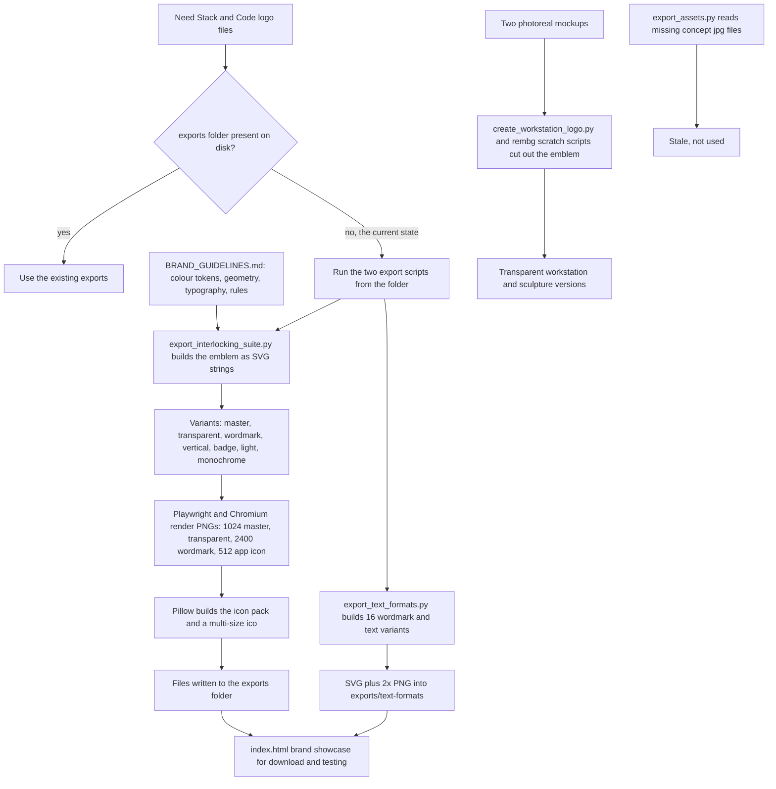

# Stack&Code Logo creator (brand kit generators)

> Python generators and an HTML showcase that define and export the Stack & Code ("SaC") brand identity: a 3D isometric interlocking hexagonal "S" monogram, with wordmark and text-format variants.

| | |
|---|---|
| **Category** | Personal tools, media pipelines and infrastructure (brand assets) |
| **Status** | Personal tool, as of 9 Oct 2026 (built, with its own git repo of 4 commits and 11 tracked files; the generated exports are not on disk) |
| **Type** | Python generator scripts plus a static HTML brand showcase |
| **Runner and schedule** | Manual: run the export scripts from the folder. Nothing is scheduled. |
| **Client / owner** | Stack&Code (the owner's own agency brand) |
| **Stack** | Python, Pillow, Playwright (Chromium), rembg (`u2netp`), hand-built SVG; no environment variables |
| **Source** | Main KB Part 7, "Stack&Code Logo creator and logo sessions" - "Logo creator" (lines 4423-4440) and register row (line 3927); Portfolio KB sections 23 and 2 |

## 1. Description

### What it does
Defines the Stack & Code brand identity and generates its logo files. The emblem is an Interlocking Hexagonal "S" Monogram: two hexagonal ribbon loops in a Hopf-link weave forming an S, with 30-degree `<` `>` code-bracket angles, in Electric Cyan `#21D3ED` and Polar Ice `#ADE3EE` on Obsidian `#07090E`. The generators build the emblem mathematically as SVG, render PNGs, and produce icon packs, wordmarks and 16 text-format variants. An interactive `index.html` shows the brand.

### Inputs and outputs
- **Inputs:** `BRAND_GUIDELINES.md` (colours, geometry, typography, rules); two photoreal mockups (`mockup-sculpture.jpg`, `mockup-workstation.jpg`) for the workstation cut-outs.
- **Outputs (produced by running the generators):** `exports\` (SVG masters, transparent, wordmark, vertical, badge, light and monochrome variants; PNGs at 1024 master, transparent, 2400 wordmark and 512 app icon; an icon pack and a multi-size `.ico`) and `exports\text-formats\` (16 variants as SVG plus 2x PNG). **These exports are not on disk**: the README and `BRAND_GUIDELINES.md` list `sac-interlocking-*.svg`, `exports\*` and `exports\text-formats\*`, but neither the working tree nor git contains them.

### Key components
| Component | Role |
|---|---|
| `BRAND_GUIDELINES.md` | Concept; colour tokens (Polar Ice, Electric Cyan `#21D3ED`, Cyber Teal `#0891B2`, Deep Oceanic `#042F3D`, Obsidian Void `#07090E`, White, Slate Gray `#94A3B8`); geometry (30 degree isometric, 1:1.14 aspect, ribbon thickness 54 px, loop offset 176 px, key light top-left); typography (Outfit Black at 0.15em for the wordmark, Inter for UI, Fira Code or JetBrains Mono for technical text); rules (keep the exclusion zone, do not rotate, recolour or stretch) |
| `export_interlocking_suite.py` | Builds the emblem as SVG strings (master, transparent, wordmark, vertical, badge, light, monochrome); renders PNGs with Playwright/Chromium; makes the icon pack and a multi-size `.ico` with Pillow |
| `export_text_formats.py` | 16 wordmark and text variants (caps, title case, lowercase, tracking, developer tags, dot notation, CLI, stacked, poster, light, transparent) as SVG plus 2x PNG; documented in `BRAND_TEXT_FORMATS.md` and `STACK_AND_CODE_TEXT_FORMATS.txt` |
| `create_workstation_logo.py` and `scratch\*` (`run_rembg.py`, mask and alpha scripts) | Cut the emblem out of the two photoreal mockups with rembg to get transparent versions |
| `index.html` (61 KB) | Interactive brand showcase: tilt card, theme switcher, downloads, colour copy, legibility tester, typography sandbox |
| `export_assets.py` | Stale: reads `concept-1.jpg` and `concept-2.jpg`, which do not exist |

### Where it lives
`D:\Project\<user>\Stack&code\Logo creator` (own `.git`, 4 commits, 11 tracked files). The neon-logo working files from the later logo sessions are in `D:\Pictures\Logos & Graphics\Stack and Code` (137 files).

## 2. Flow chart

**Reading the chart**
1. Because the generated exports are missing from disk, the way to get logo files is to run the two export scripts.
2. `export_interlocking_suite.py` builds the emblem mathematically as SVG strings using the geometry and colours in `BRAND_GUIDELINES.md`, in seven variants.
3. Playwright/Chromium renders the PNGs (1024 master, transparent, 2400 wordmark, 512 app icon) and Pillow makes the icon pack and a multi-size `.ico`, all into `exports\`.
4. `export_text_formats.py` writes 16 wordmark and text variants as SVG plus 2x PNG into `exports\text-formats\`.
5. A separate path cuts the emblem out of the two photoreal mockups with rembg to give transparent versions.
6. `index.html` is the interactive showcase (tilt card, theme switcher, downloads, colour copy, legibility tester, typography sandbox).
7. `export_assets.py` is stale and not part of the working path.

## 3. Case study

### The challenge
The source states the purpose as defining and generating the Stack & Code brand identity; it does not record the original brief. The mark is geometrically intricate (two interlocking hexagonal ribbons forming an "S"), and the asset set is large (wordmarks, app icons, favicons, 16 text lockups), so keeping every variant exact is the problem the generators address.

### The solution
Write the brand down once (guidelines with exact tokens and geometry), then generate every asset from code: the emblem is built mathematically as SVG, rendered to PNG by a headless browser, and packaged into icon sets by Pillow. A showcase page lets the brand be inspected, tested for legibility and downloaded. Photoreal mockups are cut out with rembg for transparent versions.

### Design decisions and rules learned
- Mathematical SVG construction (30 degree isometric, 1:1.14 aspect, ribbon thickness 54 px, loop offset 176 px, key light top-left) so every variant is exact.
- Brand rules are explicit: keep the exclusion zone; do not rotate, recolour or stretch.
- Rendering uses Playwright/Chromium for PNGs and Pillow for the icon pack and `.ico`; background removal for the mockup cut-outs uses rembg (`u2netp`).
- Generated exports are produced by running the scripts; they are not in the working tree or in git (the source does not say whether this was a deliberate choice).
- `export_assets.py` references `concept-1.jpg` and `concept-2.jpg` that no longer exist, so it is stale and should not be used.

### Outcome
- The generators, guidelines and showcase are built; the repo has 4 commits and 11 tracked files.
- The generated SVG/PNG exports listed in the README are not on disk or in git; they would be recreated by running the scripts.
- The later neon-logo working files (137 files) are in `D:\Pictures\Logos & Graphics\Stack and Code`.
- No usage figures recorded.

### Lessons learned
- If assets are generated, either commit the exports or document the regeneration step clearly; here the README lists files that do not exist until the scripts are run.
- Retire stale scripts (`export_assets.py`) or fix their inputs, so the folder reflects what works.
- The Portfolio KB lists the "Logo-creator export suite" among video, media and design utilities and notes their exact inputs, outputs and processes need to be documented from the repository (portfolio KB section 23). This page does that from the Main KB's file-level read.

## 4. Operating notes
- **Run / pause / debug:** From the folder: `pip install pillow playwright rembg && playwright install chromium`, then `python export_interlocking_suite.py` and `python export_text_formats.py`. Outputs appear in `exports\`.
- **Known issues and open items:** Exports missing from disk and git. `export_assets.py` is stale. Which of the neon-logo options became the final mark is covered in the sessions page (not recorded there either).
- **Risks:** Low. No environment variables or secrets are used.

## 5. Related
- [stack-and-code-logo-and-site-asset-sessions.md](stack-and-code-logo-and-site-asset-sessions.md) - the later neon logo cleanup, Canva logo update and site-asset sessions.
- **Sources:** Main KB Part 7 (lines 4423-4440; register row, line 3927). Portfolio KB sections 23 and 2 (portfolio KB): lists "Logo-creator export suite" by name only; no discrepancy.
