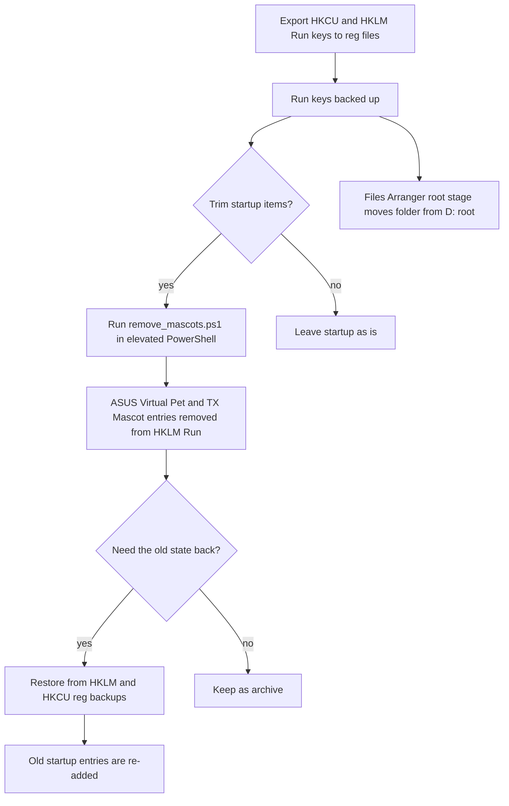

# StartupBackup

> An archive folder holding registry Run-key backups and a startup clean-up script, taken as a safety copy before trimming Windows startup items.

| | |
|---|---|
| **Category** | Personal tools, media pipelines and infrastructure |
| **Status** | Legacy or retired, as of 9 Oct 2026 (the KB labels it "Archive"; moved here by the Files Arranger) |
| **Type** | Registry export files, one PowerShell script and an older code copy |
| **Runner and schedule** | None. Nothing runs automatically; the script is run by hand in an elevated PowerShell. |
| **Client / owner** | Personal tool (Hari). Not a client or business automation. |
| **Stack** | Windows registry `.reg` exports, PowerShell |
| **Source** | Main KB Part 7, "StartupBackup" section (lines 4246-4256); Files Arranger `root` stage (line 3980); Portfolio KB has no entry |

## 1. Description

### What it does
A safety copy of the Windows startup configuration, taken before startup items were trimmed. It lets the old state be restored. The folder also includes a script that removes two ASUS startup entries.

### Inputs and outputs
- **Inputs:** none at rest. The backup files were exported from the registry Run keys.
- **Outputs:** none. The files are restore material.

### Key components
| Component | Role |
|---|---|
| `HKCU_Run_backup.reg` | Export of the current-user Run key. |
| `HKLM_Run_backup.reg` | Export of the machine-wide Run key. |
| `remove_mascots.ps1` | Removes the ASUS "Virtual Pet" and "TX Mascot" startup entries from `HKLM\...\Run`; the comment says it is reversible via the HKLM backup. |
| `ui_gamedvr_old.txt` | Listed in the source without a description. |
| `System_old\` | Older System Dashboard Pro sources and build spec. |

### Where it lives
`D:\Project\Personal Tools & Labs (hari)\Desktop & System\StartupBackup`. It was moved here from `D:\StartupBackup` by the [Files Arranger](files-arranger.md) `root` stage.

## 2. Flow chart

The sequence below is the intended use of the folder as the source describes it. Whether the removal script was actually run is not documented in the source.

**Reading the chart**
1. The Run keys are exported to `.reg` files before any change.
2. `remove_mascots.ps1` is the only change script in the folder. It needs an elevated PowerShell.
3. Restoring the `.reg` files re-adds the old startup entries, including any installed-software paths they contain.
4. The Files Arranger moved the whole folder from `D:\StartupBackup` into `Desktop & System`.

## 3. Case study

### The challenge
The source states only that this is a safety copy taken before trimming Windows startup items. The contents suggest (inferred) that the goal was to remove vendor startup entries such as the ASUS mascots while keeping the original configuration recoverable.

### The solution
Back up the Run keys as `.reg` files first, keep a removal script that states its reversal path, and keep an older copy of the dashboard code alongside. The folder was later relocated by the Files Arranger.

### Design decisions and rules learned
- **Back up before trimming**, and write down how to reverse the change (the script's comment points to the HKLM backup).
- **The `.reg` files can hold installed-software paths**, so they are not safe to share.

### Outcome
Documented facts only: the folder exists as an archive with the files listed above and was moved on the Files Arranger's `root` stage. No record of the clean-up being run or of its effect. The folder was not executed during the knowledge-base review.

### Lessons learned
- Restoring the `.reg` files re-adds the old startup entries, so restore only when that is wanted.
- Running `remove_mascots.ps1` needs an elevated PowerShell.

## 4. Operating notes
- **Run / pause / debug:** nothing runs automatically. Importing a `.reg` file restores that key; `remove_mascots.ps1` is run manually as administrator.
- **Known issues and open items:** `ui_gamedvr_old.txt` is not described in the source.
- **Risks:** system changes at registry level; do not import the backups without reviewing them. Do not publish the `.reg` files.

## 5. Related
- [Files Arranger](files-arranger.md) - relocated this folder from `D:\StartupBackup`.
- [System Dashboard Pro and AutoBoost](system-dashboard-pro-and-autoboost.md) - the source of `System_old`.
- **Sources:** Main KB Part 7 lines 4246-4256 and 3980; Portfolio KB has no entry.
