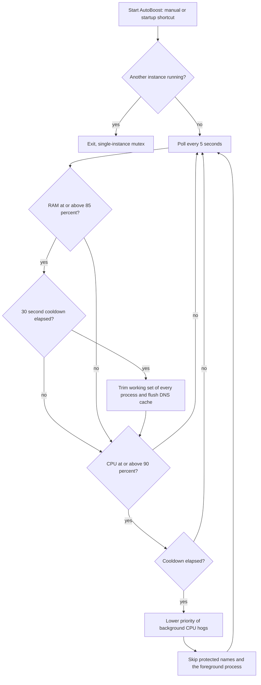
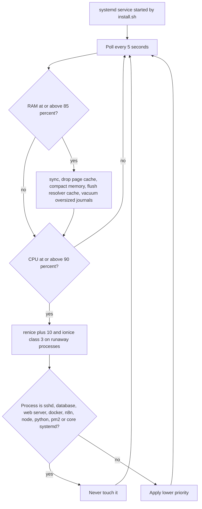

# System Dashboard Pro, AutoBoost and server AutoBoost

> Three related system utilities: a Tk monitoring dashboard, a silent Windows RAM and CPU booster, and a Linux port of that booster deployed to the owner's servers.

| | |
|---|---|
| **Category** | Personal tools, media pipelines and infrastructure |
| **Status** | Personal tool, as of 9 Oct 2026. Dashboard built to an exe; AutoBoost run on the owner's PC (inferred); server AutoBoost reported as configured and running on two servers per its README. |
| **Type** | Python Tkinter desktop dashboard, C# headless background process, Python systemd daemon for Linux |
| **Runner and schedule** | Dashboard: manual (desktop shortcut). Windows AutoBoost: manual or startup shortcut. Server AutoBoost: systemd service, 5-second poll loop. |
| **Client / owner** | Personal tool (Hari). Not a client or business automation. |
| **Stack** | Python (psutil, wmi, pycaw, comtypes, screen-brightness-control), PyInstaller, C# compiled with the in-box .NET Framework `csc.exe`, bash and batch scripts, systemd |
| **Source** | Main KB Part 7, "System Dashboard Pro, AutoBoost and server AutoBoost" section (lines 4129-4152); Portfolio KB section 24 |

## 1. Description

### What it does
`system_dashboard_pro.py` is a large Tkinter dashboard with CPU, RAM, disk, GPU and battery graphs, volume and brightness control, a system report and an auto-optimise function. `AutoBoost.cs` / `AutoBoost.exe` is a silent Windows background booster that trims memory when RAM is high and lowers the priority of CPU hogs. `server_autoboost\` ports the same idea to Linux servers. `ramcleane.py` and `ram_cleaner_gui.py` are earlier RAM-trimming tools that grew into the dashboard.

### Inputs and outputs
- **Inputs:** live RAM and CPU readings, `dashboard_config.json` (thresholds 85/85, interval, auto-optimise and silent flags), and on servers `/etc/autoboost/autoboost.conf` (thresholds and a `protected_processes` list).
- **Outputs:** freed memory and lower priorities for runaway processes; `system_performance_log.csv` (about 450 KB, from the dashboard); `/var/log` entries on servers.

### Key components
| Component | Role |
|---|---|
| `system_dashboard_pro.py` | Monitoring dashboard; built by `build_app.bat` (PyInstaller, hidden imports wmi, screen_brightness_control, comtypes, pycaw) to `dist\SystemDashboardPro.exe` (about 29 MB). |
| `install_app.ps1` | Copies the app to `%LOCALAPPDATA%\Programs\SystemDashboardPro` and creates a desktop shortcut. |
| `AutoBoost.cs` / `AutoBoost.exe` | Windows booster; `build_autoboost.bat` compiles it with `csc.exe`, no SDK needed. |
| `manage_autoboost.bat` | Menu to start, stop, add to startup (option 3) and check status. |
| `server_autoboost\autoboost_daemon.py` | Linux daemon with CLI `autoboost [status|boost|logs|start|stop|restart|enable|disable]`. |
| `install.sh`, `deploy_to_ec2.bat`, `manage_remote.bat`, `manage_ec2.bat`, `manage_ubuntu_vps.bat` | Server install and remote management over SSH. |

### Where it lives
`D:\Project\Personal Tools & Labs (hari)\Desktop & System\System`, which has its own `.git`. `StartupBackup\System_old` holds the earlier copy of the dashboard (see [StartupBackup](startupbackup.md)). A copy of `AutoBoost.exe` also sits in the `Battery exe` folder (see [BatteryBoost Pro](batteryboost-pro.md)).

## 2. Flow chart

Windows AutoBoost:

Server AutoBoost:

**Reading the chart**
1. Windows AutoBoost runs under a single-instance mutex and polls every 5 seconds.
2. At RAM 85% or more it trims the working set of every process (`EmptyWorkingSet`) and flushes the DNS cache. At CPU 90% or more it lowers the priority of background CPU hogs.
3. Protected names (system, dwm, csrss, services, lsass, taskmgr, explorer, audiodg and others) and the foreground process are skipped.
4. A 30-second cooldown separates boosts, and all errors are swallowed so no pop-up ever appears.
5. The server daemon follows the same 5-second loop. At RAM 85% or more it runs `sync`, drops the page cache through `/proc/sys/vm/drop_caches`, compacts memory, flushes the resolver cache and vacuums oversized journals.
6. At CPU 90% or more it applies `renice +10` and `ionice -c 3` to runaway processes, never touching sshd, mariadb or mysql, nginx or httpd, docker or containerd, n8n, node, python, pm2 and core systemd units.
7. The dashboard itself has no step-by-step process documented beyond the feature list above.

## 3. Case study

### The challenge
The source records no problem statement. The design implies (inferred) memory and CPU pressure on the owner's PC and on two remote servers, a wish for monitoring in one window, and automatic relief without constant attention. On the servers, the protected-process list shows that relief must never touch the services they exist to run.

### The solution
Start with RAM-trimming scripts, grow them into a Tkinter dashboard packaged as an exe, split the automatic part into a tiny silent C# booster (7 KB exe) that needs no SDK to build, then port the same threshold-and-cooldown logic to Linux as a systemd daemon with a protected-process list. Deployment to servers is scripted with SSH and SCP of five files followed by `sudo install.sh`.

### Design decisions and rules learned
- **Thresholds at 85% RAM and 90% CPU, 5-second polling, 30-second cooldown** keep the booster light and avoid repeated bursts.
- **Protected-process lists** on both platforms; on servers the list covers SSH, databases, web servers, containers, n8n, node, python, pm2 and core systemd units.
- **Compile with the in-box .NET Framework compiler** so the booster builds on any Windows PC without installing an SDK.
- **Silent by design.** Errors are swallowed so a background tool never shows a popup.
- `EmptyWorkingSet` on every process causes a short burst of page faults right after a boost; the cooldown limits that.

### Outcome
Documented facts only:
- `dist\SystemDashboardPro.exe` (about 29 MB) was built, and `system_performance_log.csv` (about 450 KB) shows the dashboard logged data.
- AutoBoost has been run on this PC: a phone-remote log pasted into a separate session shows it running and being stopped (inferred).
- The server README says AutoBoost is "configured and running" on an Amazon Linux EC2 instance and an Ubuntu VPS, and a later session read its status over SSH, so it was deployed.
- No measured memory or performance gain is recorded. No Claude Code session transcript specific to the dashboard was found.

### Lessons learned
- Trimming every process's working set causes a burst of page faults, so the boost needs a cooldown (30 seconds here).
- Server automation needs an explicit never-touch list for core services.

## 4. Operating notes
- **Run / pause / debug:** `dist\SystemDashboardPro.exe`; `manage_autoboost.bat` menu (start, stop, startup, status). Server: `server_autoboost\deploy_to_ec2.bat` then `manage_remote.bat`; on the server use the `autoboost` CLI (`status`, `logs`, `stop`, `restart`).
- **Known issues and open items:** `build/` and `dist/` PyInstaller artefacts (a 28 MB `.pkg` and a 1 MB xref HTML) are stored in the folder.
- **Risks:** dropping caches and renicing processes on live servers; a service not named in the protected list has no other documented guard (inferred). Security and credential-hygiene findings for this project are tracked privately and are not published here.

## 5. Related
- [BatteryBoost Pro](batteryboost-pro.md) - stores a copy of `AutoBoost.exe` and solves a similar problem for laptop battery.
- [Adaptive Power Manager](adaptive-power-manager.md) - another power and resource tool.
- [StartupBackup](startupbackup.md) - holds `System_old`, the earlier dashboard copy.
- **Sources:** Main KB Part 7 lines 4129-4152; Portfolio KB section 24 (lines 777-793, "BatteryBoost and AutoBoost executable builds").
