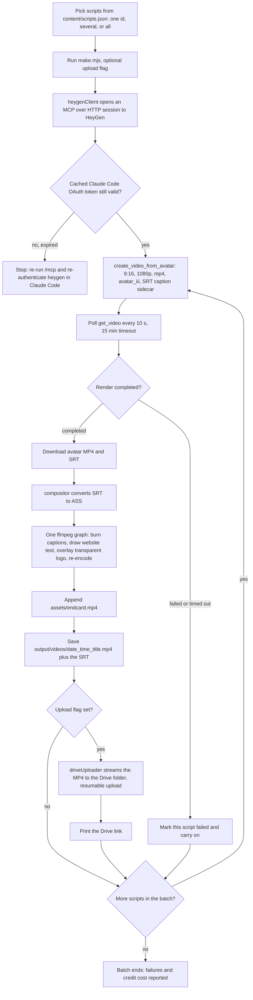

# Zaffarology video pipeline (`zaff vid`): HeyGen avatar, ffmpeg branding, Drive upload

> A Node.js pipeline that renders a HeyGen AI avatar reading written scripts, brands the footage locally with ffmpeg (captions, logo, website text, end card) and optionally uploads the finished vertical videos to Google Drive, for the Zaffarology brand.

| | |
|---|---|
| **Category** | Personal tools, media pipelines and infrastructure (client video production) |
| **Status** | On demand, as of 9 Oct 2026 (the KB calls it "Active and productive": run manually from the project folder, nothing is scheduled) |
| **Type** | Node.js (ES modules) command line pipeline, an ffmpeg compositor, a Drive uploader, and two hand-tuned "reel" scripts |
| **Runner and schedule** | Manual, from the project folder on the owner's Windows PC, or by asking Claude Code to run it. Nothing is scheduled. |
| **Client / owner** | Zaffarology (client brand), built in the Pivot client workspace |
| **Stack** | Node.js, `sharp`, ffmpeg 8.1.2 (essentials build), HeyGen remote MCP server over HTTP (OAuth), Google Drive REST API (resumable upload, OAuth Desktop client), Segoe UI and Montserrat fonts |
| **Source** | Main KB Part 7, "Zaffarology video pipeline (`zaff vid`)" and its "Sessions behind this pipeline" table (lines 4356-4417); Part 7 register row (line 3926) and "Connectors / MCP servers in use"; Portfolio KB sections 2 and 23 |

## 1. Description

### What it does
For each chosen script, the pipeline asks HeyGen to render an AI avatar speaking it as a vertical 9:16, 1080x1920 video, waits for the render, downloads the avatar MP4 and a caption file (SRT), then does all the branding locally with ffmpeg: burned captions, the brand website text, the logo, and an appended end card. The finished MP4 (with its SRT beside it) is saved locally and, with `--upload`, streamed to a Google Drive folder. Credits are spent only on the avatar render, so restyling captions, logo or end card costs nothing. A second hand-tuned "reel" script builds a 30-second edit with B-roll cards, a cover frame and a thumbnail.

### Inputs and outputs
- **Inputs:** `content\scripts.json` (11 entries, each with `id`, `title`, `script`; themes include delegation, daily huddle, teams, and hard work not scaling); env defaults for avatar, voice, engine, aspect ratio, resolution and format; HeyGen access through the OAuth token that Claude Code already cached; `assets\` (transparent logo, SVG logo, eagle icon, end card MP4, Montserrat Bold font); for reels, the script text, avatar ID, card text and segment timings hard-coded at the top of the reel script, plus the supplied CTA clip in `endslide\`.
- **Outputs:** `output\videos\<YYYY-MM-DD_HH-mm>_<Safe_Title>.mp4` with the `.srt` beside it (so caption text stays editable); a Google Drive link when uploading; for reels a final MP4 and a `THUMBNAIL_*.png`; a credit-cost report in the chat.

### Key components
| Component | Role |
|---|---|
| `scripts\make.mjs` -> `src\pipeline.js` | Entry point for standard videos; batches run one after another and tolerate individual failures |
| `src\heygenClient.js` | Opens an MCP-over-HTTP session to HeyGen's remote MCP server using the cached OAuth token |
| `src\videos.js` | Calls `create_video_from_avatar` and polls `get_video` (10 s interval, 15 min timeout) |
| `src\compositor.js` | Converts SRT to ASS and runs one ffmpeg filter graph, then appends the end card |
| `src\googleAuth.js`, `src\driveUploader.js`, `scripts\drive-connect.mjs` | One-time Google consent on a loopback redirect, cached refresh token, resumable Drive upload |
| `scripts\reel-render.mjs`, `scripts\reel-build.mjs`, `src\reel\cards.js`, `src\reel\captions.js` | The 30-second reel: avatar clip, then B-roll cards, cover, captions and end slide |
| `content\scripts.json` | The 11 scripts |
| `assets\`, `endslide\` | Logo (transparent), SVG logo, eagle icon, `endcard.mp4`, Montserrat Bold; the supplied CTA clip |
| `build\`, `fccache\` | Intermediates (cards, background, cover, fonts) and fontconfig caches |
| `output\videos\` | Finished videos, the reel MP4 and thumbnail |
| Local env settings and OAuth token cache | Real values (not opened by the KB; both git-ignored) |

### Where it lives
`D:\Project\Client & Agency (Pivot)\Zaffarology\zaff vid` (originally `D:\Project\zaff-vid`, later `D:\Project\Pivot\zaff vid`).

Environment-variable names (from `.env.example`): `HEYGEN_API_KEY`, `HEYGEN_API_BASE`, `HEYGEN_DEFAULT_AVATAR`, `HEYGEN_DEFAULT_VOICE`, `HEYGEN_DEFAULT_ENGINE`, `HEYGEN_DEFAULT_ASPECT_RATIO`, `HEYGEN_DEFAULT_RESOLUTION`, `HEYGEN_DEFAULT_FORMAT`, `HEYGEN_REFERENCE_VIDEO_ID`, `HEYGEN_POLL_INTERVAL_SECONDS`, `HEYGEN_POLL_TIMEOUT_MINUTES`, `HEYGEN_MAX_RETRIES`, `HEYGEN_RETRY_BASE_MS`, `HEYGEN_REQUEST_TIMEOUT_MS`, `DOWNLOAD_DIRECTORY`, `DRIVE_UPLOAD_FOLDER_ID`, `GOOGLE_CLIENT_ID`, `GOOGLE_CLIENT_SECRET`, `GOOGLE_OAUTH_PORT`, `GOOGLE_DRIVE_SCOPE`, `GOOGLE_TOKEN_FILE`. ffmpeg is at a hard-coded local path (the `FFMPEG_PATH` override works only in `compositor.js`). Fonts `seguibl.ttf` and `segoeuib.ttf` are copied from Windows per run.

## 2. Flow chart

Standard video (one script, several, or all):



The 30-second reel (hand-tuned, values hard-coded in the scripts):

```mermaid
flowchart LR
    R1["reel-render.mjs renders one avatar clip, avatar_iii"] --> R2["Save build/avatar.mp4, avatar.srt, meta.json"]
    R2 --> R3["reel-build.mjs draws navy radial background with a thin gold frame"]
    R3 --> R4["Cover frame and thumbnail with ffmpeg drawtext, Montserrat Bold"]
    R4 --> R5["Ten typographic B-roll cards with slow zoom-pan"]
    R5 --> R6["Cut 13 timed segments, avatar or card, from the SRT boundaries"]
    R6 --> R7["Add 0.8 s cover and 4.2 s end slide"]
    R7 --> R8["Layer one-word-per-line captions, website text and small eagle icon top-left"]
    R8 --> R9["Write final MP4 and THUMBNAIL png"]
    R9 --> R10["Next reel: edit the hard-coded values in reel-build.mjs"]
```



**Reading the charts**
1. The owner (or Claude Code on request) picks scripts from `content\scripts.json` and runs `make.mjs`, optionally with `--upload`.
2. `heygenClient.js` opens an MCP-over-HTTP session to HeyGen using the OAuth token Claude Code cached after `/mcp` authentication.
3. If the token has expired the run stops and the owner re-authenticates heygen in Claude Code with `/mcp`.
4. `videos.js` calls `create_video_from_avatar` (9:16, 1080p, mp4, `avatar_iii`, SRT sidecar) and polls `get_video` every 10 seconds, up to 15 minutes, until the render is `completed` or `failed`.
5. A failed or timed-out render is recorded and the batch continues; failures are reported at the end.
6. The avatar MP4 and SRT are downloaded and `compositor.js` converts the SRT to ASS and runs one ffmpeg graph: captions (Segoe UI Black 76 pt, margin 420 px), the website text at y=1600, the transparent logo (340 px wide, top centre), re-encode (libx264 CRF 18, 30 fps, AAC 192k, faststart), then concatenates `assets\endcard.mp4`.
7. The video is saved with its SRT. With `--upload`, `driveUploader.js` streams it to Google Drive and prints the link.
8. Reel chart: `reel-render.mjs` renders one avatar clip; `reel-build.mjs` then builds the background, cover, thumbnail, ten B-roll cards, cuts 13 timed segments from the SRT, adds the 0.8 s cover and 4.2 s end slide, layers captions, website text and the eagle icon, and writes the final MP4 and thumbnail (29.93 s, 72% B-roll, one avatar render).
9. The next reel is an edit of the values hard-coded at the top of `reel-build.mjs`, not a new tool.

## 3. Case study

### The challenge
The Zaffarology brand needed short, consistent, vertical videos of an AI avatar delivering written scripts, with the brand's captions, logo, website line and call-to-action end card on every one, and the finished files landing in Google Drive. Constraints: HeyGen credits are limited and should be spent on the avatar render only; the branding has to be repeatable and editable without re-rendering; and the first working approach, HeyGen's REST API key, drew on a separate wallet that turned out to be empty ("credit balance too low").

### The solution
A plain Node agent used daily rather than an app. It started as a request on 2026-07-28 to build a production-ready, reusable HeyGen integration for Claude Code, and ended up as a local pipeline. HeyGen is reached through its remote MCP server using the OAuth token that Claude Code already cached, so renders draw on the plan's credits. Everything visual (captions, website line, logo, end card) is composed locally with ffmpeg on the downloaded footage. Google Drive upload uses a resumable streamed upload with a one-time browser consent. A separate pair of reel scripts adds B-roll cards, cover frame and thumbnail for a 30-second edit.

How it was built, from the three sessions behind it:

| Session | When | What happened |
|---|---|---|
| "HeyGen API integration for Claude Code" | 2026-07-28 to 07-31, `D:\Project\zaff vid` | Prompt: build a production-ready, reusable HeyGen client for Claude Code. Switched to a plain Node agent used daily; fetched avatars and voices so the avatar could be chosen; tested against an existing reference video; moved to HeyGen's remote MCP (OAuth) to use plan credits instead of the empty API wallet; added burned captions, the website line, Avatar IV and a Canva-made end slide; set up Drive upload (OAuth Desktop client). On 07-31 swapped in the new transparent logo, rolled back to Avatar III and rendered all 11 scripts (206 to 195 credits) into an "AI video Gen" Drive folder, verified through the Google Drive connector. |
| "HeyGen API integration for Claude Code (fork)" | 2026-08-13, `D:\Project\Pivot\zaff vid` | A "Master Reel Prompt" template for the team: fill Section 1 (brand, logo, avatar, length, caption font and colours, cover text, CTA text, script) and keep Sections 2-8 fixed. It enforces a logo top-left, cover frame, CTA slide, one-word-per-line captions, 70-80% B-roll, a strict credit-saving order (stock, stills plus motion, reuse, AI image, AI video last) and a final quality checklist. This fork produced the 29.9 s reel for 1 credit. Two earlier fork copies of the session also exist. |
| "Claude mcp list" | 2026-08-13 06:00, `D:\Project\Pivot\zaff vid` | Ran `claude mcp list`: 15 servers, 11 connected (HyperFrames by HeyGen, vidIQ, Zoom, Fathom, Spotify, Google Drive, ClickUp, Slack, Canva, Google Calendar, Gmail), 3 needing auth (Hugging Face, Miro, heygen), 1 failed (`MCP_DOCKER`, the docker MCP gateway, connection closed - likely Docker Desktop not running). Then `/mcp` authenticated heygen (full API toolset: video agent, avatars, voices, templates, translations, lipsync, assets). |

### Design decisions and rules learned
- **Auth:** the REST API key bills a separate HeyGen wallet that was empty, so the project reuses the HeyGen OAuth session cached by Claude Code so renders use the plan's credits. The token expires; if the script says so, re-run `/mcp` and re-authenticate heygen in Claude Code.
- **Credits:** one Avatar III render of about 19 s cost exactly 1 credit (206 to 205); 11 videos cost 11. Avatar IV looks more human but costs more and was used for one early video; the owner then rolled back to Avatar III. `avatar_iii` rejects `expressiveness` and `motionPrompt`, so the code drops them. Caption, logo and end-card restyling is free because it is local ffmpeg on already-rendered footage.
- **Drive scope:** with the default `drive.file` scope the app can only see folders it created. To write into an existing folder, widen `GOOGLE_DRIVE_SCOPE` to full `drive`, delete the cached Google token and re-consent. The OAuth client is a Desktop type. If Google returns no refresh token, revoke the app and consent again.
- **Streaming uploads:** Drive uploads are streamed with `duplex: 'half'`; attaching a `data` listener to the source stream breaks the upload, so the code counts progress in a pass-through Transform instead.
- **Assets:** the logo must have a transparent background (an earlier version came out with a white box). Fonts must be real files: a Montserrat download once saved junk bytes and everything fell back to monospace until it was re-fetched.
- **Text rendering:** `sharp`/librsvg on Windows ignores embedded fonts, so all text is drawn by ffmpeg `drawtext`.
- **Reel captions** are proportional to character length, not forced alignment, so a fast word can drift by about 100 ms. A Whisper alignment step was suggested but not built.
- **Git hygiene:** `.gitignore` excludes env files, the OAuth token cache, client-secret files, `output/` and `*.mp4`.
- **Reels are edits, not a tool:** the reel scripts hold script text, avatar ID, card text and segment timings at the top, so the next reel is an edit of `reel-build.mjs`.

### Outcome
- 11 videos generated on 2026-07-31 (credits 206 to 195), uploaded to an "AI video Gen" Drive folder and verified through the Google Drive connector.
- A 29.93 s reel on 2026-08-13: 72% B-roll, one avatar render, 1 credit. `output\videos` holds the reel MP4 and its thumbnail.
- The standard path produces a video plus an editable SRT per script, with a credit-cost report in chat.
- Related connector evidence (Part 7 connectors section): 15 direct HeyGen MCP calls (asset upload create, complete and get) in the zaff-vid sessions, plus the Node pipeline's own HTTP calls to the same endpoint; 49 Google Drive connector calls, all in the zaff-vid sessions.
- No time-saving or cost-saving figure is recorded.

### Lessons learned
- Separate rendering from branding: spending credits only on the avatar render makes every later style change free.
- Reuse the OAuth session you already have rather than a second billing wallet, and expect to re-authenticate when it expires.
- Check scope before choosing the Drive permission level; the narrow default cannot see existing folders.
- Real font files and a truly transparent logo are prerequisites; both failures were silent.
- A hand-tuned template (the Master Reel Prompt) gives the team a repeatable reel recipe, but the reel scripts themselves are one-off edits.
- HyperFrames (HeyGen's HTML-composition video framework) is connected as an MCP server, but no HyperFrames tool was ever called in any transcript and no HyperFrames code is in `zaff vid`; the local compositing is ffmpeg.

## 4. Operating notes
- **Run / pause / debug:**
  ```
  cd "D:\Project\Client & Agency (Pivot)\Zaffarology\zaff vid"
  node scripts/drive-connect.mjs                 # one-time Google consent (optional)
  node scripts/make.mjs 1                        # one script; also: 1 2 3 | all
  node scripts/make.mjs all --upload             # render all and upload to Drive
  node scripts/make.mjs 1 --engine=avatar_iv --expressiveness=medium
  node scripts/reel-render.mjs && node scripts/reel-build.mjs   # the 30 s reel
  ```
  Claude Code's HeyGen MCP must be authenticated first. If the run says the token expired, run `/mcp` and authenticate heygen. Nothing runs on a schedule, so there is nothing to pause.
- **Known issues and open items:** reel caption drift of about 100 ms (Whisper alignment not built); ffmpeg path is hard-coded locally; the current Drive scope and the HeyGen avatar and voice defaults are only in the unopened env settings. A HeyGen REST-API client is not what shipped. Which avatar and voice IDs are in use is not recorded.
- **Risks:** The pipeline depends on the OAuth session cached by Claude Code, which expires. Widening the Drive scope to full `drive` gives the app access to the whole Drive. Avatar IV renders cost more credits than Avatar III (the amount is not recorded). Security and credential-hygiene findings for this project are tracked privately and are not published here.

## 5. Related
- [../03-ghl-crm-migrations/zaffarology-list-split-and-import-estimate.md](../03-ghl-crm-migrations/zaffarology-list-split-and-import-estimate.md) - other Zaffarology work (a 1.2M-record list into GHL).
- [connectors-and-mcp-servers-in-use.md](connectors-and-mcp-servers-in-use.md) - the HeyGen, Google Drive and HyperFrames connectors as counted across all transcripts.
- Canva was used manually for the end slide here: the connectors section found no Canva tool call, only an end-slide MP4 exported by the owner.
- **Sources:** Main KB Part 7 (lines 4356-4417, plus the connectors table, lines 4472-4476). Portfolio KB sections 2 and 23 (portfolio KB): "HeyGen API integration for Claude Code" and "Zaffarology video pipeline (zaff vid) using Google tokens" are listed as a mix of API integration, content generation, design work and export utilities whose inputs, outputs, authentication and deployment still had to be documented. **Discrepancy:** the Portfolio KB's wording suggests a HeyGen API integration authenticated with Google tokens; the Main KB (read from real files) shows HeyGen is reached through the remote MCP with Claude Code's cached OAuth token, and Google OAuth is used only for the Drive upload. The Main KB is followed.
