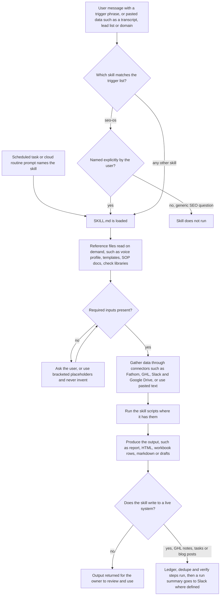
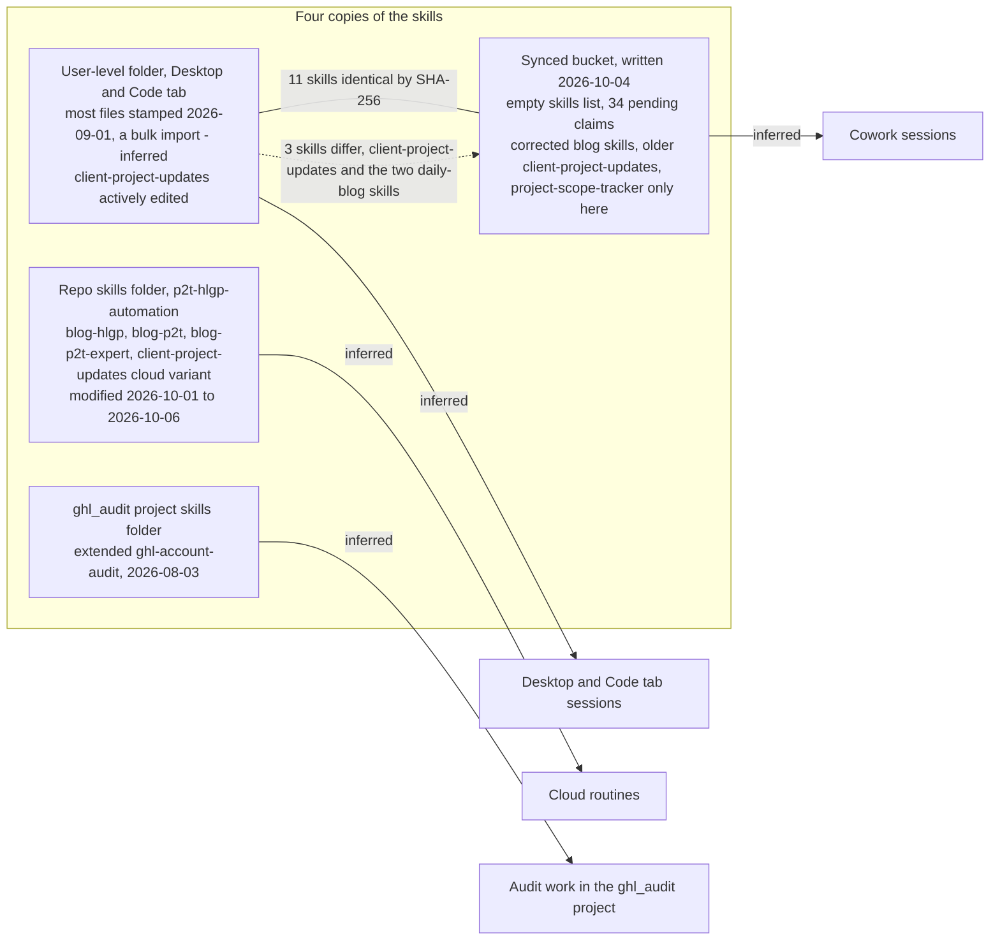

# Custom Claude skills: overview and index

> An index of the owner's hand-made Claude skills (reusable process playbooks), where the four drifted copies live, which skills have their own project file, and the risks to watch.

| | |
|---|---|
| **Category** | Claude skills |
| **Status** | Reference, as of 9 Oct 2026 |
| **Type** | Skills index and register (about 23 custom skills across four folder locations) |
| **Runner and schedule** | Mostly manual, invoked in chat by trigger phrase. Two families drive automation: `client-project-updates` (local scheduled task) and the blog skills (formerly Cowork tasks, now cloud routines). |
| **Client / owner** | P2T (Pivot 2 Thrive) and HLGP (HL Growth Partner); the owner's own skills (owner: Hari) |
| **Stack** | `SKILL.md` playbooks with reference files, Python and Node scripts; Fathom, GoHighLevel and Slack connectors; Claude desktop, Code tab, Cowork and cloud routines |
| **Source** | Main KB Part 8 (lines 4499-4842, read 9 Oct 2026); Portfolio KB sections 27-28 (lines 818-863) |

## 1. Description

### What it does
The skills library holds the owner's repeatable ways of working as Claude skills: content engines, newsletters, SOP and scope writing, sales and SEO playbooks, GoHighLevel specialist skills, and a strategy advisor persona. Each skill is a `SKILL.md` that says when it triggers, what inputs it needs, the workflow, the rules and the outputs, often with reference files and scripts beside it. There is no global `CLAUDE.md`, so standing rules (ask before assuming, never fabricate specifics, Australian English, no em-dashes in sales and newsletter copy, never print tokens, GHL-hosted images only) live inside the skills.

This file is the index. Skills that have a project file written elsewhere link to it; the ten skills with no other home have their own file in this folder. Third-party and bundled skills are named at the end of the table only.

### Inputs and outputs
- **Inputs:** a trigger phrase or pasted data (transcript, lead list, copy, domain, HTML), or a scheduled task or cloud routine prompt that names the skill. Many skills also pull from the Fathom, GHL, Slack and Google Drive connectors.
- **Outputs:** vary by skill: GHL notes, tasks and blog posts; email HTML; markdown documents; spreadsheet rows; audit reports; drafts for the owner to send.

### Key components

All skills (custom, from the KB summary table, lines 4516-4543):

| Skill | One-line purpose | Used by | Detail |
|---|---|---|---|
| client-project-updates | Fathom calls to GHL scope notes, team tasks, stage moves and a Slack run summary for P2T and HLGP, de-duplicated by a ledger | Local scheduled task (enabled, weekdays cron `30 10 * * 1-5`, last run 2026-10-09); a cloud-routine variant exists in the repo | [client-project-updates](../01-scheduled-tasks-reporting/client-project-updates.md) |
| hlgp-daily-blog-post | Write and publish 3 GHL blog posts a day to the HLGP site | Formerly a Cowork task; now cloud routine `blog-hlgp` (repo skill of the same engine). Not in the local scheduled-task list | [hlgp-daily-seo-blog-engine](../02-content-seo-newsletters/hlgp-daily-seo-blog-engine.md) |
| p2t-daily-blog-post | Write and publish 3 blog posts a day to the P2T site | Formerly a Cowork task; now cloud routine `blog-p2t` | [p2t-daily-blog-engine](../02-content-seo-newsletters/p2t-daily-blog-engine.md) |
| blog-p2t-expert (repo only) | 31-topic "Claude Expert / AI Expert Australia" cluster, one post per Mon/Wed/Fri run | Formerly a Cowork task; now cloud routine `blog-p2t-expert` | [p2t-claude-expert-topic-engine](../02-content-seo-newsletters/p2t-claude-expert-topic-engine.md) |
| hlgp-weekly-newsletter | Draft the weekly HLGP newsletter text from the last 7 days of Fathom calls | Manual, no schedule found | [hlgp-weekly-newsletter-drafter](../02-content-seo-newsletters/hlgp-weekly-newsletter-drafter.md) |
| newsletter-hlgp | Pasted copy to the "HL Growth Brief" email HTML from a locked template | Manual | [hl-growth-brief-email-builder](../02-content-seo-newsletters/hl-growth-brief-email-builder.md) |
| newsletter-p2t | Pasted copy to the P2T weekly newsletter HTML from a locked template | Manual | [p2t-weekly-newsletter-builder](../02-content-seo-newsletters/p2t-weekly-newsletter-builder.md) |
| voice-to-branded-newsletter | Voice note or transcript to branded newsletter markdown via an LLM script | Manual | [voice-note-to-branded-newsletter](../02-content-seo-newsletters/voice-note-to-branded-newsletter.md) |
| weekly-content-engine-sop | Weekly LinkedIn newsletter and authority-post operating system | Manual, team SOP | [weekly-content-engine-sop](../02-content-seo-newsletters/weekly-content-engine-sop.md) |
| p2t-sop-writer | Detect repeatable tasks and write table-format SOPs into the P2T SOP Playbook workbook | Manual | [p2t-sop-writer](p2t-sop-writer.md) |
| transcript-to-scope-sop | Call transcript to Idea Brief, Scope of Work and delivery SOPs, evidence-backed | Manual | [transcript-to-scope-sop](transcript-to-scope-sop.md) |
| project-scope-tracker (synced bucket only) | Transcript and proposal to a client-facing Google Sheet tracker and Slack drafts | Manual; hands notes to the client-project-updates pipelines | [project-scope-tracker](project-scope-tracker.md) |
| pivot2thrive-funnel-economics | Paid-ads funnel leak diagnostic, calculator and branded PDF | Manual | [pivot2thrive-funnel-economics](pivot2thrive-funnel-economics.md) |
| sales-engine | Daily outbound ritual: AI Agency in a Box (Track A) and paid speaking (Track B) | Manual. The sales-call-report routine is a separate prompt, not this skill | [sales-engine](sales-engine.md) |
| seo-os | SEO Operating System: 6-phase framework and 6 SOP documents | Manual, only on explicit invocation | [seo-os](seo-os.md) |
| website-audit | Scripted full crawl and four-lens website audit | Manual | [website-audit](website-audit.md) |
| ghl-account-audit | 260-check, business-need-driven GoHighLevel account audit | Manual | [ghl-account-audit](../03-ghl-crm-migrations/ghl-account-audit.md) |
| ghl-ai-prompt-builder | HTML, screenshots or descriptions to paste-ready GHL Ask AI and workflow prompts | Manual | [ghl-ai-prompt-builder-and-search-for-ghl](../03-ghl-crm-migrations/ghl-ai-prompt-builder-and-search-for-ghl.md) |
| search-for-ghl | Research a requirement, then architect it natively inside GHL | Manual | [ghl-ai-prompt-builder-and-search-for-ghl](../03-ghl-crm-migrations/ghl-ai-prompt-builder-and-search-for-ghl.md) |
| servicem8-ghl-migration | ServiceM8 to GHL custom-objects migration with tested Node code | Manual, per client project | [servicem8-ghl-migration-engine](../03-ghl-crm-migrations/servicem8-ghl-migration-engine.md) |
| priya-business-advisor | Strategy advisor persona carrying a business baseline (sensitive) | Manual | [priya-business-advisor](priya-business-advisor.md) |
| clone-blueprint | 12-field "AI clone" identity card that drives content creation | Manual | [clone-blueprint](clone-blueprint.md) |
| markitdown-converter | Any file or URL to Markdown with Microsoft markitdown | Manual; also named in transcript-to-scope-sop Phase 0 | [markitdown-converter](markitdown-converter.md) |
| morning, excel-live-control, publish-artifact-to-sites, review-agent | Third-party or bundled, not the owner's (an Anthropic example skill and OpenAI/Codex skills) | n/a | No file |

Other bundled skills seen and skipped (skill-creator, schedule, docx/pdf/pptx/xlsx, mcp-builder, import-memory and similar) and the vendor skill families (firecrawl, figma, bigquery, gcp, canva, notion, dbt, openai, supabase, agy) are not the owner's and have no entries here.

Scheduled tasks and routines that do NOT use a skill (own prompts): [cafe-grato-order-monitor](../01-scheduled-tasks-reporting/cafe-grato-order-monitor.md) (enabled, every 2 h 08:00-20:00), `mwf-client-blog-posts` (Summit Air and Solar Flex client blogs, Mon/Wed/Fri 15:00, disabled, last run 2026-10-08; see [client-blog-engine-summit-air-solar-flex](../02-content-seo-newsletters/client-blog-engine-summit-air-solar-flex.md)), the Cowork [blog-engine-watchdog](../02-content-seo-newsletters/blog-engine-watchdog.md) (alert-only check posting to Slack `#daily_blog_posts`), and the cloud routine `sales-call-report` ([sales-call-report-dashboard](../01-scheduled-tasks-reporting/sales-call-report-dashboard.md)).

### Standing instructions and settings, at a high level
- **No global instruction file.** `C:\Users\<user>\.claude\CLAUDE.md` does not exist, and there are no user-level custom agents or slash commands.
- **User settings.** Model `sonnet`, effort `low` for both listed models, no `permissions` block and no `hooks`.
- **Project folders.** About 30 project-level `.claude` folders under `D:\Project`, mostly allow-lists and dev-server configs. The pipeline project pre-approves the client-project-updates workflow (its script commands, Fathom and Slack tools, GHL contact reads for both accounts).
- **Per-project memory.** About 55 project folders under the user `.claude\projects\`, about 20 with a `MEMORY.md`. The pipeline project's memory records the skill build, the materiality rule and sales-report findings.
- **Plugins.** One user-built plugin, `ghl-pivot2thrive` v0.1.0 (GHL contacts, pipelines, conversations, calendars), plus vendor plugins (cowork-plugin-management, productivity, slack-by-salesforce) that are not the owner's.
- **Automation.** Local scheduled tasks (`client-project-updates` enabled, `mwf-client-blog-posts` disabled, `cafe-grato-order-monitor` enabled) and cloud routines in the repo `routines/*.md`: `blog-p2t`, `blog-hlgp`, `blog-p2t-expert`, `client-project-updates`, `sales-call-report`. Run state sits on repo branches `state-client-updates` and `state-sales-report`. See [cloud-migration-oct-2026](../02-content-seo-newsletters/cloud-migration-oct-2026.md).

### Documentation standard
Portfolio KB section 28 suggests documenting each skill with: name and purpose, trigger conditions, required and optional inputs, workflow steps, tools or APIs, output format, error handling, security and privacy, example invocation, test cases, known limitations, and version history. It adds: do not infer behaviour from a skill's name, inspect its `SKILL.md`. The skill files in this folder follow that standard where the Main KB gives the facts; error handling, example invocations and test results are mostly not documented in the source (only `p2t-sop-writer` and `transcript-to-scope-sop` are noted as having `evals/evals.json`, with no results recorded).

### Where it lives
| Location | What it is | Notes |
|---|---|---|
| User-level skills folder | Desktop and Code-tab user skills | Most files carry a bulk-copy stamp of 2026-09-01 (inferred: a bulk import, not the authoring date). `client-project-updates` is the actively edited one (SKILL.md 2026-09-21, config.json 2026-09-29, ghl.py 2026-09-25). |
| Skill-sync bucket | Claude desktop / Cowork skill-sync copy, written 2026-10-04 | The manifest has an empty `skills` list and 34 pending claims (the custom skills plus built-ins such as docs, deep-research, chrome-browser, xlsx). Holds `project-scope-tracker`, which exists nowhere else, corrected versions of the two daily-blog skills, and an OLDER `client-project-updates`. |
| Routines repo (`p2t-hlgp-automation`) | Repo of cloud-routine skills, modified 2026-10-01 to 2026-10-06 | `blog-hlgp`, `blog-p2t`, `blog-p2t-expert`, `client-project-updates` (cloud-routine variant). The newest blog and client-update playbooks. |
| Project-level skills folder in the `ghl_audit` project | Extended audit skill, 2026-08-03 | Adds `execution-playbook.md` and `deliverable-formats.md` to the user-level version. |

Identical between user-level and synced (SHA-256 match): clone-blueprint, ghl-account-audit, ghl-ai-prompt-builder, markitdown-converter, newsletter-hlgp, newsletter-p2t, p2t-sop-writer, priya-business-advisor, sales-engine, servicem8-ghl-migration, website-audit. Different: client-project-updates, hlgp-daily-blog-post, p2t-daily-blog-post. For the other skills the comparison is not documented in the source.

## 2. Flow chart

Two charts. The first shows how a skill is triggered and used, built from the trigger, input and output fields the KB records for each skill (the generic step of loading `SKILL.md` on a match is standard skill behaviour, not stated in the KB). The second shows the four copies and which surface probably reads each one; the "reads" edges are the KB's own inference.

**Reading the chart**
1. A skill starts from a chat trigger phrase or pasted data, or from a scheduled task or cloud routine that names it.
2. `seo-os` is the exception: it runs only when named ("run my SEO OS"), never on a generic SEO question.
3. `SKILL.md` is loaded and its reference files are read on demand (for example the sales voice profile or the newsletter templates).
4. If required inputs are missing the skill asks, or uses bracketed placeholders; it never invents numbers, names or URLs.
5. Data comes from connectors (Fathom, GHL, Slack, Drive) or pasted text; bundled scripts then do the mechanical work.
6. Output is either handed back for the owner to review, or, for the engines that write to GHL, protected by a ledger or dedupe check and verified before a Slack summary.

**Reading the chart**
1. The user folder, synced bucket, repo folder and `ghl_audit` folder each hold some of the skills; 11 skills are byte-identical between the user folder and the synced bucket.
2. Three skills differ between those two copies, and the direction of the difference is not the same: the synced blog skills are the corrected ones, while the synced `client-project-updates` is the older one.
3. Which copy a given surface loads is not stated in the KB; the arrows to Desktop and Code, Cowork, cloud routines and the audit project are the KB's inference.
4. Because a copy can be edited in one place and not the others, the library needs one declared active copy per skill.

## 3. Case study

### The challenge
Work for P2T, HLGP and their clients repeats: daily blog posts, weekly newsletters, client call notes, sales outreach, SOPs, audits, migrations. Each needs the same rules and the same checks every time. With no global `CLAUDE.md`, those rules and the specialist know-how had to be captured somewhere reusable. The origin story inside `client-project-updates` shows the pressure: an audit found only 4 notes across 17 clients before the skill existed.

### The solution
A library of Claude skills, each a self-contained playbook with its own trigger phrases, inputs, workflow and rules. Some are pure playbooks (sales, SEO, advisor, SOP writing, funnel economics). Some ship scripts (website-audit has six Python scripts, newsletters have fill and validate scripts, `servicem8-ghl-migration` ships tested Node code, `client-project-updates` ships `cpu.py` and `ghl.py`). A few run on a schedule or as cloud routines and write to GHL. The most active skills were then copied into a repo for cloud routines and into the desktop skill-sync bucket.

### How the library grew
The sequence below is reconstructed from file dates, many of which are bulk-import stamps, so treat it as indicative (inferred):
1. **Playbooks and specialist skills.** Most user-level files are stamped 2026-09-01, a bulk import; authoring is likely earlier (skill text cites approvals on 2026-07-15 and 2026-07-21, and the advisor baseline is dated July 2026). The extended GHL audit skill is dated 2026-08-03 and was unpacked from a downloaded `.skill` file; `search-for-ghl` v1 is dated 2026-08-31. `voice-to-branded-newsletter` appears to have been authored on Manus (inferred).
2. **Corrections to the blog skills (from 2026-09-09).** The corrected versions replaced fallback image hosts, a Python upload blocked by Cloudflare, an injected H1, bare-slug links and a missing canonical link.
3. **Operational skills tied to the pipelines.** The `client-project-updates` skill was built on 2026-09-14 (per project memory) and scheduled daily; the materiality rule (log only bigger updates) was added on 2026-09-21. `servicem8-ghl-migration` is dated 2026-09-18 and was learned on a real account (8,645 companies, 10,357 jobs, 7,207 contacts).
4. **Cloud routines and sync (October 2026).** Repo copies of the blog and client-update skills were modified 2026-10-01 to 2026-10-06 and the desktop skill-sync bucket was written on 2026-10-04.

### Design decisions and rules learned
- Rules live inside skills because there is no global instruction file; the skills themselves say "never print the token", "ask before assuming" and "no fabricated claims".
- `seo-os` is explicit-invocation only so it does not fire on generic SEO questions.
- A skill name is not evidence of its behaviour (Portfolio KB sections 28 and 36); do not call a folder name a completed automation.
- Only one runner of `client-project-updates` (cloud or local) may be live at a time, because state would otherwise diverge.
- Hard-coded lists of live pages inside the blog skills must be updated when pages are unpublished, or posts will link to pages that redirect to home (inferred, Part 2 section 15).
- The `priya-business-advisor` skill carries personal and financial context and is treated as sensitive; its file in this folder is deliberately high level.

### Outcome
Documented facts only: about 23 custom skills catalogued (the Portfolio KB lists 15 reported names); 11 are identical between the user folder and the synced bucket and 3 differ; `project-scope-tracker` exists only in the synced bucket; `p2t-sop-writer` and `transcript-to-scope-sop` have eval files; the `client-project-updates` local task is enabled with a last run of 2026-10-09. No measured time saving or quality outcome is recorded for the library as a whole.

### Lessons learned
- Copies drift quickly: four locations produced three different versions of `client-project-updates` and older blog skills that still carried fixed defects.
- Anything embedded in a skill file travels with the skill, including into any sync, so keep skill files free of environment-specific values.
- Dependencies assumed from another platform (a Manus CLI, a missing `recalc.py`) break silently when a skill is moved.
- Record the real authoring date and the active copy somewhere; file stamps from a bulk import hide both.

## 4. Operating notes
- **Run / pause / debug:** Invoke a skill in chat by trigger phrase (see each skill's file). Pause `client-project-updates` by disabling the local scheduled task; the cron is set in the Claude desktop Scheduled sidebar, not in the task file. The cloud blog routines are controlled in claude.ai/code Routines. Debug by checking which copy the surface actually loaded before editing any copy.
- **Known issues and open items (Main KB lines 4832-4842):**
  1. Version drift: the 2026-09-01 user-level `p2t-daily-blog-post` and `hlgp-daily-blog-post` still hold defects fixed on 2026-09-09. The skill text records about 158 published HLGP posts with dead catbox covers and about 144 with slow iili.io covers (as of 2026-09-09), plus about 37 dead or slow P2T covers.
  2. `client-project-updates` has three differing copies (stage moves versus "never change a stage"). Which copy each surface loads is not stated.
  3. Schedules are unclear for `hlgp-weekly-newsletter`, `newsletter-*`, `voice-to-branded-newsletter`, `weekly-content-engine-sop`, `sales-engine` and the audit skills; all are treated as manual.
  4. Possibly missing dependencies: `voice-to-branded-newsletter` expects a `manus-speech-to-text` CLI and `/home/ubuntu/...` paths and its OpenAI key variable is unconfirmed; `p2t-sop-writer` refers to `scripts/recalc.py`, which is not in its folder, and the `P2T_SOP_Playbook.xlsx` location is not stated.
  5. Not read in depth: `check-library.md`, the SEO OS `.docx` SOPs, the website-audit scripts, the ServiceM8 Node source, the funnel-economics PDF template, the newsletter reference templates, `docs/SETUP.md`, per-project MEMORY files, and the watchdog beyond its header.
  6. Dates: most user-level modified times look like a bulk import, so real authoring dates are likely earlier (inferred).
  7. The ServiceM8 skill lacks the later fixes made for Wasteman (Main KB Part 1 section 5; see [wasteman-servicem8-ghl-migration](../03-ghl-crm-migrations/wasteman-servicem8-ghl-migration.md)).
- **Risks:**
  - Security and credential-hygiene findings for the skills library are tracked privately and are not published here.
  - A sensitive skill (`priya-business-advisor`) sits in the same folders and the synced bucket as the others.
  - Portfolio KB discrepancies: it lists 15 reported skills and marks `morning` and `priya-business-advisor` as uncertain in origin. The Main KB, read from the real folders, identifies `morning` as an Anthropic example skill and `priya-business-advisor` as the owner's, and adds `hlgp-weekly-newsletter`, `voice-to-branded-newsletter`, `project-scope-tracker`, `search-for-ghl`, `clone-blueprint`, `markitdown-converter` and `blog-p2t-expert`. The Main KB is preferred.

## 5. Related
- Skill files in this folder: [sales-engine](sales-engine.md), [seo-os](seo-os.md), [website-audit](website-audit.md), [pivot2thrive-funnel-economics](pivot2thrive-funnel-economics.md), [p2t-sop-writer](p2t-sop-writer.md), [transcript-to-scope-sop](transcript-to-scope-sop.md), [project-scope-tracker](project-scope-tracker.md), [priya-business-advisor](priya-business-advisor.md), [clone-blueprint](clone-blueprint.md), [markitdown-converter](markitdown-converter.md).
- Skills with project files elsewhere are linked in the table above.
- **Sources:** Main KB Part 8 (lines 4499-4842: organisation of the folders, summary table, per-skill sections, standing instructions, gaps); Main KB Part 1 sections 4-5 (security checklist and open items, for cross-reference); Portfolio KB sections 27-28 and 36.
