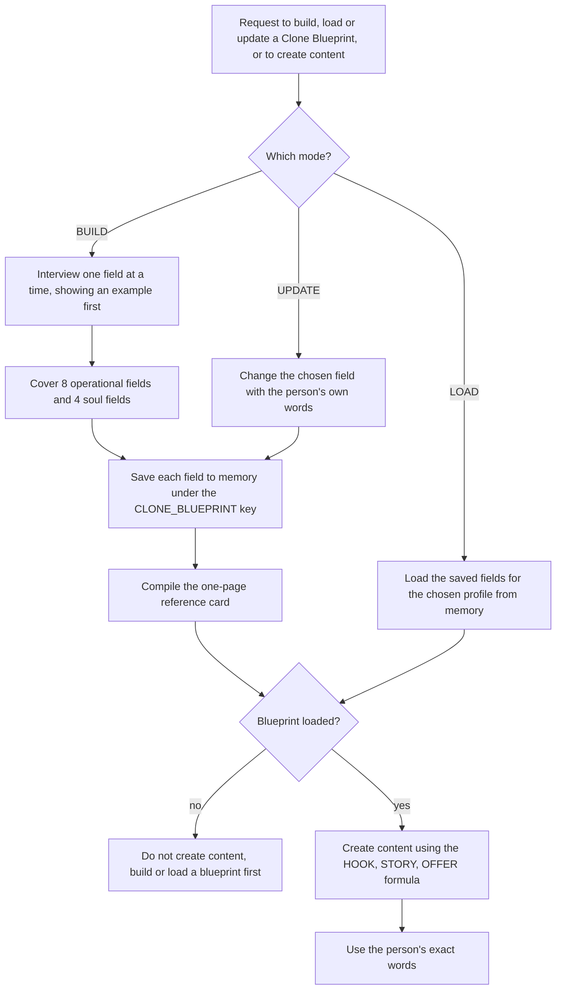

# clone-blueprint (12-field AI clone identity card skill)

> A Claude skill that builds, saves and loads a 12-field "Clone Blueprint" identity card for a personal brand or business, so all AI content creation starts from the person's own niche, offer, tone and story.

| | |
|---|---|
| **Category** | Claude skills (content and brand voice) |
| **Status** | On demand, as of 9 Oct 2026 |
| **Type** | Claude skill with three reference files; state is kept in Claude memory |
| **Runner and schedule** | Manual, invoked in chat. No schedule. |
| **Client / owner** | The owner's personal brand and businesses; also used for workshop participants |
| **Stack** | Claude skill; Claude memory (no connectors or scripts) |
| **Source** | Main KB Part 8 clone-blueprint section (lines 4779-4784) and summary table (line 4541); Portfolio KB sections 27-28 (not listed there) |

## 1. Description

### What it does
`clone-blueprint` is an "AI clone" identity card with 12 fields that powers all AI content creation for a personal brand or business. It has three modes: BUILD (interview the person one field at a time, giving an example first), LOAD (bring a saved blueprint into the session) and UPDATE. Content is only created once a blueprint is loaded, and it follows a HOOK / STORY / OFFER structure.

### Inputs and outputs
- **Inputs:** the person's answers to the interview, one field at a time. Trigger phrases are not recorded in the source (Not documented in the source).
- **Outputs:** a saved blueprint (one memory entry per field) and a compiled one-page reference card; later, content built from the loaded blueprint.

### Key components
| Component | Role |
|---|---|
| 8 operational fields | Niche; core offer and price; CTA keyword; brand colour; brand font; avatar; audience; tone |
| 4 soul fields | Origin story; biggest win; known-for; WHY |
| Memory keys | Saved as `CLONE_BLUEPRINT::<Profile>::<Field>` so more than one profile can coexist |
| `references/fields.md` | Definitions and examples for each field |
| `references/blueprint-template.md` | The one-page reference card layout |
| `references/content-formulas.md` | The HOOK / STORY / OFFER content formulas |

### Where it lives
`C:\Users\<user>\.claude\skills\clone-blueprint\` (stamp 2026-09-01, a bulk-import stamp). The synced copy under `skills\synced\...` is identical (SHA-256 match). The blueprints themselves live in Claude memory, not in the skill folder.

## 2. Flow chart

**Reading the chart**
1. A request names a mode: BUILD a new blueprint, LOAD a saved one, or UPDATE a field.
2. BUILD interviews one field at a time and shows an example first. The 12 fields are 8 operational (niche, core offer and price, CTA keyword, brand colour, brand font, avatar, audience, tone) and 4 soul fields (origin story, biggest win, known-for, WHY).
3. Each answer is saved to Claude memory under a `CLONE_BLUEPRINT` key, and a one-page reference card is compiled.
4. LOAD brings a saved profile into the session; UPDATE changes a single field.
5. Content creation is blocked until a blueprint is loaded; once loaded, content follows HOOK / STORY / OFFER using the person's exact words.

## 3. Case study

### The challenge
The skill's premise is that all AI content creation for a personal brand or business should start from a fixed description of the person. It is used for the owner's own brand and for workshop participants, so it has to be quick to build and reusable across sessions. The KB gives no specific client example.

### The solution
A fixed identity card that captures both the practical brand facts (niche, offer, colours, fonts, audience, tone) and the personal story (origin, win, what the person is known for, and their WHY). Storing each field in memory under a profile key lets the card be loaded in a later session without repeating the interview.

### Design decisions and rules learned
- Never create content without a loaded blueprint.
- Use the person's exact words rather than paraphrasing them.
- Interview one field at a time and show an example first, so the person can answer concretely.
- Content follows HOOK / STORY / OFFER.

### Outcome
No measured outcome recorded. The source does not say how many blueprints have been built.

### Lessons learned
- Splitting "operational" from "soul" fields keeps brand mechanics separate from the story that makes content personal.
- Because blueprints live in Claude memory, they depend on that memory being available in the session (the only stated dependency).

## 4. Operating notes
- **Run / pause / debug:** Invoke in chat and choose BUILD, LOAD or UPDATE. Nothing is scheduled. If content comes out generic, check whether a blueprint is actually loaded.
- **Known issues and open items:** Trigger phrases are not recorded in the source. The number of saved profiles is not recorded.
- **Risks:** Stored fields include personal origin stories, so the memory entries are personal data about the profile owner; for workshop participants, treat their blueprints as theirs.

## 5. Related
- [Skills overview](00-skills-overview.md)
- [weekly-content-engine-sop](../02-content-seo-newsletters/weekly-content-engine-sop.md): a content system whose voice profile plays a similar role.
- **Sources:** Main KB Part 8 lines 4541 and 4779-4784; Portfolio KB sections 27-28.
