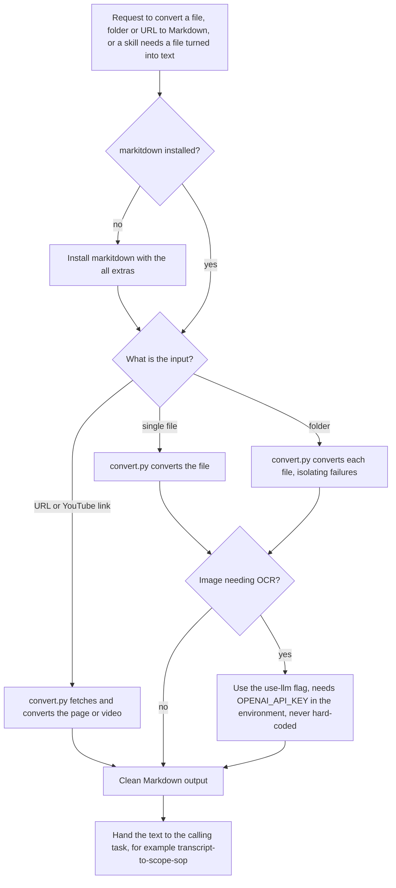

# markitdown-converter (any file or URL to Markdown skill)

> A Claude skill that converts PDF, Word, PowerPoint, Excel, HTML, data files, images, audio, EPUB, email, ZIP and YouTube URLs into clean Markdown using Microsoft markitdown, singly or in batches.

| | |
|---|---|
| **Category** | Claude skills (utility) |
| **Status** | On demand, as of 9 Oct 2026 |
| **Type** | Claude skill with one Python script (`scripts/convert.py`) |
| **Runner and schedule** | Manual, invoked in chat. Also named as the file-conversion step in `transcript-to-scope-sop` Phase 0. |
| **Client / owner** | P2T and HLGP (internal utility) |
| **Stack** | Python; Microsoft `markitdown[all]`; optional LLM step for image text, configured through the `OPENAI_API_KEY` and `LLM_MODEL` environment variables |
| **Source** | Main KB Part 8 markitdown-converter section (lines 4786-4790) and summary table (line 4542); Portfolio KB sections 27-28 (not listed there) |

## 1. Description

### What it does
`markitdown-converter` turns documents and media into clean Markdown that Claude can read and reuse. `scripts/convert.py` handles a single file, a folder batch, or a URL, and isolates failures so one bad file does not stop a batch. It does the reverse of the docx, pptx and pdf creation skills.

### Inputs and outputs
- **Inputs:** a file (PDF, Word, PowerPoint, Excel, HTML, CSV, JSON, XML, images, audio, EPUB, `.msg`, ZIP), a folder of files, or a URL including YouTube. Trigger phrases are not recorded in the source (Not documented in the source).
- **Outputs:** Markdown text or `.md` files. The output location is not recorded in the source.

### Key components
| Component | Role |
|---|---|
| `scripts/convert.py` | Single file, folder batch, URL conversion; failure isolation |
| `markitdown[all]` | The conversion library; installed if missing |
| `--use-llm` option | Image text recognition through an LLM; needs the environment variable `OPENAI_API_KEY` (optional `LLM_MODEL`) |

### Where it lives
`C:\Users\<user>\.claude\skills\markitdown-converter\` (stamp 2026-09-01, a bulk-import stamp). The synced copy under `skills\synced\...` is identical (SHA-256 match).

## 2. Flow chart

**Reading the chart**
1. A user request, or another skill (`transcript-to-scope-sop` Phase 0), needs a file turned into text.
2. If `markitdown[all]` is not installed, it is installed first.
3. The input type decides how `convert.py` runs: one file, a folder (each file converted separately so failures are isolated), or a URL including YouTube.
4. Image text recognition uses the optional `--use-llm` flag, which reads the key from the `OPENAI_API_KEY` environment variable; a key must never be hard-coded.
5. The Markdown output goes back to the calling task.

## 3. Case study

### The challenge
The skill's purpose is to turn inputs of many formats (PDF, Word, PowerPoint, Excel, web pages, images, audio, YouTube) into Markdown, and `transcript-to-scope-sop` names it for converted transcript files. The KB gives no specific incident behind the skill.

### The solution
A small wrapper script around Microsoft markitdown that covers a wide range of formats, handles batches without stopping at the first failure, and keeps the one credential-dependent feature (image OCR via an LLM) optional and driven by an environment variable.

### Design decisions and rules learned
- Install `markitdown[all]` if it is missing.
- Never hard-code a key; `--use-llm` reads `OPENAI_API_KEY` (and optionally `LLM_MODEL`) from the environment.
- Isolate failures so a batch continues.

### Outcome
No measured outcome recorded. The source documents the skill's capabilities and rules only.

### Lessons learned
- A shared conversion utility lets other skills (such as `transcript-to-scope-sop`) accept messy file inputs without each building its own converter.

## 4. Operating notes
- **Run / pause / debug:** Invoke in chat or via another skill. Nothing is scheduled. If image conversion fails, confirm `OPENAI_API_KEY` is set in the environment.
- **Known issues and open items:** Trigger phrases and output location are not recorded in the source.
- **Risks:** The optional LLM image step presumably sends image content to an external service (inferred from the OpenAI key variable); keep the key in the environment, never in the skill.

## 5. Related
- [Skills overview](00-skills-overview.md)
- [transcript-to-scope-sop](transcript-to-scope-sop.md): uses this skill for file inputs in Phase 0.
- **Sources:** Main KB Part 8 lines 4542 and 4786-4790; Portfolio KB sections 27-28.
