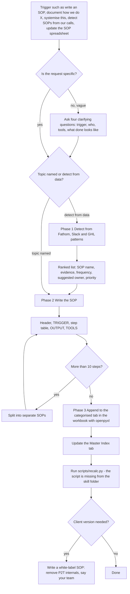

# p2t-sop-writer (SOP detection and writing skill)

> A Claude skill that detects repeatable tasks from calls, Slack and GHL patterns, writes crisp table-format SOPs, and appends them to the master P2T SOP Playbook workbook, with an optional white-label client version.

| | |
|---|---|
| **Category** | Claude skills (operations and SOPs) |
| **Status** | On demand, as of 9 Oct 2026 |
| **Type** | Claude skill with an `evals/evals.json` test file |
| **Runner and schedule** | Manual, invoked in chat. No schedule. |
| **Client / owner** | Pivot2Thrive and HL Growth Partner (internal), with a white-label mode for client SOPs |
| **Stack** | Claude skill; Fathom and Slack connectors; openpyxl; `scripts/recalc.py` (referenced, not present); the xlsx skill (inferred) |
| **Source** | Main KB Part 8 p2t-sop-writer section (lines 4649-4658), summary table (line 4529) and gaps (line 4837); Portfolio KB sections 27-28 (name only) |

## 1. Description

### What it does
`p2t-sop-writer` is a full-system SOP engine in three phases: DETECT repeatable tasks, WRITE crisp table SOPs, and OUTPUT them to the master `P2T_SOP_Playbook.xlsx`. It can work from a topic the user names or from live data (Fathom meetings, Slack questions, GHL patterns). It can also produce a white-label version of an SOP for a client by removing P2T internals and writing "your team".

### Inputs and outputs
- **Inputs:** a topic, or live data: Fathom meetings (tasks mentioned 3 or more times), Slack (repeated "how do I..." questions found with `slack_search_public_and_private`), and GHL pipeline or conversation patterns. A vague request triggers four clarifying questions.
- **Outputs:** SOP rows in the playbook workbook; optionally a client white-label version.

### Key components
| Component | Role |
|---|---|
| Phase 1 Detect | Produces a list: SOP name, evidence, frequency, suggested owner, HIGH/MEDIUM/LOW priority |
| Phase 2 Write | Header (number, title, owner, frequency, priority), TRIGGER, a Step/Action/Who/Tool/Time table of at most 10 steps (verb-first, one action per step, tool named), OUTPUT, TOOLS |
| Phase 3 Output | Appends to a categorised tab (Daily Ops, Sales and Onboard, Delivery, Content, Finance, Team and Systems, Comms) with openpyxl, updates the Master Index tab, then runs `python scripts/recalc.py` |
| Embedded roster | A team and tool roster so SOP owners and tools are named consistently (roles such as strategy and sales, operations manager, GHL builds, CRM setup, content, marketing, design, developer, support; tools GHL, Slack, WhatsApp, Gmail, Fathom, the PM app, Xero, Stripe, Canva, Google Docs and Drive, Zoom, YouTube Studio, Loom, LiveAgent) |
| `evals/evals.json` | Test cases; results not recorded in the source |

### Where it lives
`C:\Users\<user>\.claude\skills\p2t-sop-writer\` (stamp 2026-09-01, a bulk-import stamp). The synced copy under `skills\synced\...` is identical (SHA-256 match). The playbook workbook `P2T_SOP_Playbook.xlsx` has no stated location in the source.

## 2. Flow chart

**Reading the chart**
1. The skill starts when the owner asks to write, document or systemise a process, to detect SOPs from calls, or uploads a Fathom transcript for process extraction.
2. A vague request gets four clarifying questions (trigger, who does it, which tools, what "done" looks like) before any writing.
3. When no topic is given, Phase 1 mines Fathom (tasks mentioned 3 or more times), Slack (repeated "how do I..." questions) and GHL patterns, and returns a ranked list with evidence and a suggested owner.
4. Phase 2 writes each SOP in the fixed format with no more than 10 verb-first steps; longer processes are split.
5. Phase 3 appends the SOP to the right category tab, updates the Master Index tab, and recalculates the workbook.
6. A white-label version can be produced for clients.

## 3. Case study

### The challenge
The skill's design mines three places for repeated work: Fathom calls, Slack questions and GHL pipeline or conversation patterns. The aim is to find which tasks repeat, write them in a form a team member can follow, and keep them in one master playbook. The KB gives no specific incident behind the skill.

### The solution
A three-phase engine with a rigid SOP format (a table of steps with who, tool and time) so every SOP looks the same, a categorised workbook as the single store, and live-data detection so the SOP list can come from evidence rather than guesswork. The embedded team and tool roster keeps owners and tools consistent.

### Design decisions and rules learned
- No jargon; one action per step; name the tool in each step.
- If a step list passes 10, split it into separate SOPs.
- A vague request is not guessed at: four clarifying questions come first.
- Detection needs evidence (tasks mentioned 3 or more times) and a frequency, not a hunch.
- Styling is specified (navy `#1B2A4A` header, priority colouring) so the workbook stays consistent.

### Outcome
No measured outcome recorded. The source does not state how many SOPs were written or where the playbook sits; the `evals/evals.json` file exists but its results are not recorded.

### Lessons learned
- The skill depends on `scripts/recalc.py`, which is not in the skill folder, so the recalculation step cannot run as written. Part 1 section 5 of the Main KB lists this as an open item.
- A shared playbook needs a known home; the workbook location is not recorded.

## 4. Operating notes
- **Run / pause / debug:** Invoke in chat ("write an SOP", "detect SOPs from our calls"). Fathom and Slack connectors must be available for the detect phase. Nothing is scheduled.
- **Known issues and open items:** `scripts/recalc.py` is missing from the folder; the `P2T_SOP_Playbook.xlsx` location is not stated.
- **Risks:** Pulling Slack and Fathom content into SOPs can carry internal detail; the white-label mode exists to strip P2T internals before anything goes to a client.

## 5. Related
- [Skills overview](00-skills-overview.md)
- [transcript-to-scope-sop](transcript-to-scope-sop.md): can escalate its delivery SOPs into this playbook.
- [weekly-content-engine-sop](../02-content-seo-newsletters/weekly-content-engine-sop.md): another SOP-style operating system, for content.
- **Sources:** Main KB Part 8 lines 4529, 4649-4658 and 4837; Main KB Part 1 section 5 item 10; Portfolio KB sections 27-28.
