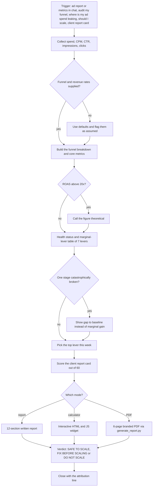

# pivot2thrive-funnel-economics (paid-ads funnel diagnostic skill)

> A Claude skill that finds where paid-acquisition spend leaks across an impressions-to-customers funnel, ranks the highest-leverage fix and issues a scale or no-scale verdict, as a written report, an interactive calculator or a branded PDF.

| | |
|---|---|
| **Category** | Claude skills (paid ads and funnel analysis) |
| **Status** | On demand, as of 9 Oct 2026 |
| **Type** | Claude skill with a README, a PDF template and a report generator script |
| **Runner and schedule** | Manual, invoked in chat when ad metrics or a funnel question is raised. No schedule. |
| **Client / owner** | P2T (named for Pivot2Thrive); used for the owner's and clients' paid-ads funnels |
| **Stack** | Claude skill; Python (`scripts/generate_report.py`, `generate_pdf.md`); the visualize widget tool for the calculator; HTML-to-PDF tooling (inferred) |
| **Source** | Main KB Part 8 pivot2thrive-funnel-economics section (lines 4682-4691) and summary table (line 4532); Portfolio KB sections 27-28 (name only) |

## 1. Description

### What it does
The skill diagnoses where paid-acquisition spend leaks across a funnel (impressions, clicks, landing page, demo booking, show, close, customer), ranks the single highest-leverage fix, and issues one of three verdicts: SAFE TO SCALE, FIX BEFORE SCALING or DO NOT SCALE. The method is credited to HQ Digital (author named in the skill) and adapted for SaaS lead generation. It runs in three modes: a full written report, an interactive calculator, or a 6-page branded client PDF.

### Inputs and outputs
- **Inputs:** ad spend, CPM, CTR, impressions and clicks from an ad report (Meta, Google, LinkedIn, YouTube, TikTok) or typed into chat (spend, CPM, CTR, CPL, ROAS, CAC). Optional funnel rates and revenue inputs. Defaults when not supplied: landing-page conversion 18%, demo booking 22%, show 70%, close 18%; contract value $2,000, retention 12 months, gross margin 80%.
- **Outputs:** (1) a 12-section written report; (2) an interactive calculator as an HTML/JS widget; (3) a 6-page branded PDF.

### Key components
| Component | Role |
|---|---|
| `SKILL.md` | Trigger rules, the 12-section report, mode selection, honesty rules |
| README and PDF template | Branded client PDF layout |
| `scripts/generate_report.py`, `generate_pdf.md` | Generate the 6-page PDF |
| Calculator widget | Interactive HTML/JS version of the funnel math |
| Marginal-lever table | Seven levers ranked by impact; handles the "marginal lever trap" by showing the gap to baseline when one stage is catastrophically broken |
| Client report card | Scored out of 60 |

The 12 report sections: inputs real versus assumed; funnel breakdown; core metrics; health status; marginal-lever table of seven levers; top lever this week; client report card scored out of 60; scaling recommendation; creative-testing priorities; budget allocation; 30/60/90-day pipeline forecast; one-line diagnosis.

### Where it lives
`C:\Users\<user>\.claude\skills\pivot2thrive-funnel-economics\` (stamp 2026-09-01, a bulk-import stamp). Brand styling in the PDF: navy `#03112c`, green `#00ce48`, amber `#f5a623`, red `#d64545`; fonts Bebas Neue, DM Mono and Inter. Whether a synced copy exists or matches is not documented in the source.

## 2. Flow chart

**Reading the chart**
1. The skill starts when ad metrics or a funnel question appear (a report from an ad platform, or numbers typed in chat).
2. Spend, CPM, CTR, impressions and clicks are the minimum inputs.
3. Any rate the user does not give is filled from the defaults and flagged as "assumed", so modeled and measured numbers are never mixed silently.
4. The funnel and core metrics are computed; a ROAS above 20x is called out as theoretical.
5. Seven levers are ranked in the marginal-lever table. When one stage is badly broken, the skill shows the gap to baseline instead (the "marginal lever trap").
6. The top lever for the week is chosen and the client report card is scored out of 60.
7. The output goes out as a written report, a calculator widget or a branded PDF.
8. Every mode ends with the scale verdict and the attribution line.

## 3. Case study

### The challenge
The skill's stated purpose is to find where paid-acquisition spend leaks across the funnel and to say whether spend should be scaled. Its triggers ("should I scale", "client report card") show it is meant for both P2T's own ads and client reporting, with a clear verdict and a presentable output. The KB records the design rather than a specific client engagement.

### The solution
A methodology-driven skill adapted from HQ Digital's approach for SaaS lead generation. It turns a handful of ad metrics into a funnel model, ranks levers, scores a report card, and outputs in whichever form the audience needs: a written report for working sessions, a calculator for exploration, a PDF for the client.

### Design decisions and rules learned
- Be honest about modeled versus measured numbers; defaults must be labelled "assumed".
- Every recommendation is tied to a number.
- Call out ROAS above 20x as theoretical.
- Handle the marginal-lever trap rather than recommending a small tweak when one stage is broken.
- Close with the attribution line crediting the methodology.

### Outcome
No measured outcome recorded. The source documents the skill's structure and brand styling, not diagnoses delivered or spend decisions made.

### Lessons learned
- Keeping defaults explicit and flagged avoids passing assumptions off as results.
- Offering three output modes lets the same analysis serve an internal review, an exploration session and a client handover.

## 4. Operating notes
- **Run / pause / debug:** Say "audit my funnel", "where is my ad spend leaking", "should I scale", "client report card", or mention Pivot2Thrive funnel economics, with ad metrics. Nothing is scheduled.
- **Known issues and open items:** The PDF template and generator were not read in depth by the KB author. The HTML-to-PDF tooling is inferred, not confirmed.
- **Risks:** Default funnel rates are assumptions; a verdict built on defaults is only as good as those defaults, which is why they must be flagged.

## 5. Related
- [Skills overview](00-skills-overview.md)
- [priya-business-advisor](priya-business-advisor.md): hands paid-ads and funnel questions to this skill.
- **Sources:** Main KB Part 8 lines 4532 and 4682-4691; Portfolio KB sections 27-28.
