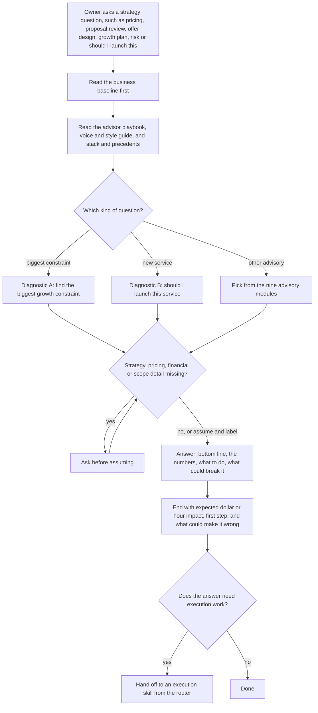

# priya-business-advisor (strategy advisor persona skill, high level only)

> A Claude skill that gives the business owner a consistent senior-advisor voice for strategy, pricing, operations, finance and risk questions, so the business context does not need re-explaining each time. This file describes purpose and mechanics only.

| | |
|---|---|
| **Category** | Claude skills (strategy advisor) |
| **Status** | Personal tool, as of 9 Oct 2026 |
| **Type** | Claude skill (persona and advisory playbook with reference files) |
| **Runner and schedule** | Manual, invoked in chat. No schedule. |
| **Client / owner** | The business owner, for the owner's own businesses (Pivot 2 Thrive, HL Growth Partner and a third business) |
| **Stack** | Claude skill; reference markdown files only; no connectors or scripts |
| **Source** | Main KB Part 8 priya-business-advisor section (lines 4769-4777) and summary table (line 4540); Portfolio KB sections 27-28 (listed as uncertain in origin) |

> **Sensitive skill.** The Main KB flags that this skill's reference baseline contains private business context. Nothing from that baseline is reproduced in this file, and it should not be added to portfolio material.

## 1. Description

### What it does
`priya-business-advisor` is a model-independent senior business advisor persona (strategy consultant, private-equity operating partner, CFO and COO in one voice). It carries a baseline of the owner's businesses, so strategy questions such as pricing, proposals, offers, growth plans, risk and "should I launch this" can be answered without restating the background. It also routes the owner to the right execution skill when the question turns into doing the work.

### Inputs and outputs
- **Inputs:** a strategy or decision question from the owner. The skill reads its reference files first: a business baseline (read first), an advisor playbook, a voice and style guide, and a stack-and-precedents file (technology stack, decision precedents, and a router to the execution skills).
- **Outputs:** an advisory answer in a fixed shape: bottom line first, the numbers, what to do, and what could break it. Every recommendation ends with the expected impact in dollars or hours, a first step, and what could make it wrong.

### Key components
| Component | Role |
|---|---|
| Business baseline reference file | The business baseline, read first (sensitive; not described here) |
| `advisor-playbook.md` | How the advisor works |
| `voice-and-style.md` | Tone and answer style |
| `stack-and-precedents.md` | Tools, decision precedents and the router to other skills |
| Nine advisory modules | Opportunity identification, operations, finance, growth plan, business model, leadership, expansion, risk, force hard decisions |
| Two diagnostics | A "biggest growth constraint" and B "should I launch this service" |

### Where it lives
The user-level Claude skills folder. An identical copy exists in the skill-sync bucket (SHA-256 match), so the sensitive baseline is present in both places.

## 2. Flow chart

**Reading the chart**
1. The skill starts from a strategy question: business strategy, growth planning, pricing, proposal reviews, offer design, operational efficiency, financial analysis, risk, hiring or delegation, expansion, or evaluating a deal or partnership.
2. The business baseline is read first, then the playbook, voice guide and precedents.
3. The question maps to one of two diagnostics (biggest growth constraint, or whether to launch a service) or one of nine advisory modules.
4. On strategy, pricing, financials or scope the skill asks before assuming; on other topics it assumes and labels the assumption.
5. The answer follows the fixed shape, and each recommendation closes with impact, first step and what could make it wrong.
6. When the question turns into execution, it hands off to the matching skill: sales-engine, seo-os, funnel economics, p2t-sop-writer, the newsletters, the content engine or ghl-ai-prompt-builder.

## 3. Case study

### The challenge
Strategy questions across three businesses need the same background every time: who the offers serve, how they are priced, what is in flight and where the risks are. Re-explaining that in each chat is slow and error-prone. The KB does not record specific decisions the skill has supported.

### The solution
A persona skill that front-loads a business baseline and a set of precedents, plus a defined advisory method (modules, diagnostics and answer shape). A router in the precedents file points execution work to the specialist skills, so strategy and execution stay separate.

### Design decisions and rules learned
- Ask before assuming on strategy, pricing, financials and scope; otherwise assume and label.
- Do not sugarcoat; lead with the bottom line.
- Never fabricate specifics: use bracketed placeholders.
- Treat the owner's named frameworks and products as ownable IP.
- Apply a Hormozi-style lens to offer design.
- Treat the whole skill as sensitive because of the private business context in the baseline.

### Outcome
No measured outcome recorded. The source documents the skill's structure only.

### Lessons learned
- Putting the business baseline in a reference file removes repeated set-up, but it also makes the skill a sensitive asset that is copied with the rest of the library.
- Keeping advisory and execution skills separate, joined by a router, avoids one skill growing too large.

## 4. Operating notes
- **Run / pause / debug:** Invoke in chat on a strategy question. Nothing is scheduled. Keep the baseline up to date.
- **Known issues and open items:** The Portfolio KB lists this skill as uncertain in origin; the Main KB, which read the real folders, confirms it is the owner's.
- **Risks:** The skill holds private business context and is copied into the skill-sync bucket along with the other skills. Treat it as sensitive; review before sharing the skills folder or this repository.

## 5. Related
- [Skills overview](00-skills-overview.md)
- Execution skills it hands off to: [sales-engine](sales-engine.md), [seo-os](seo-os.md), [pivot2thrive-funnel-economics](pivot2thrive-funnel-economics.md), [p2t-sop-writer](p2t-sop-writer.md), [weekly-content-engine-sop](../02-content-seo-newsletters/weekly-content-engine-sop.md), [p2t-weekly-newsletter-builder](../02-content-seo-newsletters/p2t-weekly-newsletter-builder.md), [hl-growth-brief-email-builder](../02-content-seo-newsletters/hl-growth-brief-email-builder.md), [ghl-ai-prompt-builder-and-search-for-ghl](../03-ghl-crm-migrations/ghl-ai-prompt-builder-and-search-for-ghl.md).
- **Sources:** Main KB Part 8 lines 4540 and 4769-4777; Portfolio KB sections 27-28.
