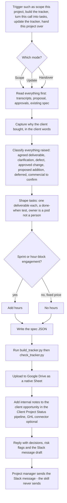

# project-scope-tracker (call and proposal to client scope tracker skill)

> A Claude skill that turns a client call transcript plus the agreed proposal into a client-facing scope and a Google Sheet project tracker, with paste-ready Slack messages for the project manager. It exists only in the synced skill bucket.

| | |
|---|---|
| **Category** | Claude skills (scoping and project tracking) |
| **Status** | On demand, as of 9 Oct 2026 |
| **Type** | Claude skill with two Python scripts, five reference files and an example spec |
| **Runner and schedule** | Manual, invoked in chat. No schedule. |
| **Client / owner** | P2T and HLGP delivery work (client-facing output) |
| **Stack** | Claude skill; Fathom; Google Drive tool; Slack (drafts only); optional GHL connector for the right account; Python build script; LibreOffice for recalculation (optional) |
| **Source** | Main KB Part 8 project-scope-tracker section (lines 4671-4680), summary table (line 4531) and folder table (line 4510); Portfolio KB sections 27-28 (not listed there) |

## 1. Description

### What it does
`project-scope-tracker` reads a client call transcript from Fathom and the agreed proposal, then produces a client-facing scope and a Google Sheet tracker built to the owner's approved layout. It works in three modes: Scope (a new project), Update (after a check-in call) and Handover. It also prepares internal notes for the client's opportunity in the Client Project Status pipeline and drafts Slack messages for the project manager, which it never sends.

### Inputs and outputs
- **Inputs:** transcript(s), the proposal and any written approvals, an existing spec JSON or tracker (for Update and Handover), and actual hours if recorded.
- **Outputs:** one client workbook with a fixed layout (Tracker, stage tabs, Handover, Change Request), a "GHL notes" markdown file, an updated spec JSON, and Slack message drafts.

### Key components
| Component | Role |
|---|---|
| `SKILL.md` | Modes, workflow and rules |
| `scripts/build_tracker.py` | Builds the workbook from the spec JSON |
| `scripts/check_tracker.py` | Checks the built tracker |
| `references/classification.md` | How to classify everything raised on a call |
| `references/task-granularity.md` | One client-recognisable deliverable per task, with a "done when" test |
| `references/tracker-spec.md`, `team-defaults.md`, `slack-messages.md` | Spec format, team defaults and Slack message formats |
| `assets/example-spec.json` | Example spec |

### Where it lives
Only in the Claude desktop / Cowork skill-sync bucket (written 2026-10-04). It exists nowhere else, so it is not in the user-level folder or the repo. The default change-request address is the P2T team mailbox.

## 2. Flow chart

**Reading the chart**
1. A scope, tracker, update or handover request starts the skill; the mode decides how much existing material is read.
2. Everything is read first, and the reason the client bought is captured in their own words.
3. Every item raised is classified (agreed deliverable, clarification, defect, approved change, proposed addition, deferred, or commercial item to confirm).
4. Tasks are shaped to one client-recognisable deliverable each with a "done when" test. The owner is a pod, never an individual. Hours appear only for sprint or hour-block engagements, never for fixed-price work.
5. The spec JSON is written, the workbook is built and checked, and it is uploaded to Google Drive as a native Sheet.
6. Internal notes go on the client's opportunity in the Client Project Status pipeline (maintained by `client-project-updates`).
7. The reply lists decisions and risk flags and includes Slack drafts for the project manager to send.

## 3. Case study

### The challenge
A new project needs the call turned into a scope the client can read and a tracker the team can work from, without adding commercial terms that were never agreed. Updates after check-in calls and handovers need the same discipline. The KB gives no specific client engagement behind the skill.

### The solution
A skill with a fixed workbook layout (the owner's approved tracker, not to be restyled), a spec-driven build, and a classification step that stops items from drifting into scope. Output is split cleanly: the client workbook carries no internal notes or individual names, while internal notes go to the GHL pipeline and Slack drafts go to the project manager.

### Design decisions and rules learned
- The tracker reflects the agreement and never creates commercial terms.
- Never invent hours, price or exclusions.
- Nothing is marked "Complete" without evidence.
- Internal notes and individual names stay out of the client workbook.
- The layout is the approved tracker and must not be restyled.
- Owner is a pod, never an individual; hours only for sprint or hour-block engagements.
- Slack messages are drafted, never sent.

### Outcome
No measured outcome recorded. The source documents the skill's structure, not trackers delivered.

### Lessons learned
- The skill exists in only one copy, the synced bucket (timestamp 2026-10-04), so it has no backup in the user folder or the repo.
- It is designed to work with `client-project-updates`, which maintains the Client Project Status pipelines it writes notes into.

## 4. Operating notes
- **Run / pause / debug:** Invoke in chat ("scope this project", "build the tracker", "update the tracker from this call", mentions of a 20-hour sprint or Phase 1/Phase 2). Run `check_tracker.py` after every build. LibreOffice is optional, for recalculation.
- **Known issues and open items:** Single-copy skill. The source does not record how the synced bucket loads it or whether the Google Drive upload has been used in production.
- **Risks:** Handles client transcripts and a client-facing deliverable; the rules keep internal notes and individual names out of the workbook.

## 5. Related
- [Skills overview](00-skills-overview.md)
- [client-project-updates](../01-scheduled-tasks-reporting/client-project-updates.md): maintains the Client Project Status pipelines this skill hands notes to.
- [transcript-to-scope-sop](transcript-to-scope-sop.md): the sibling skill that produces an Idea Brief, Scope of Work and SOPs from a transcript.
- **Sources:** Main KB Part 8 lines 4510, 4531 and 4671-4680.
