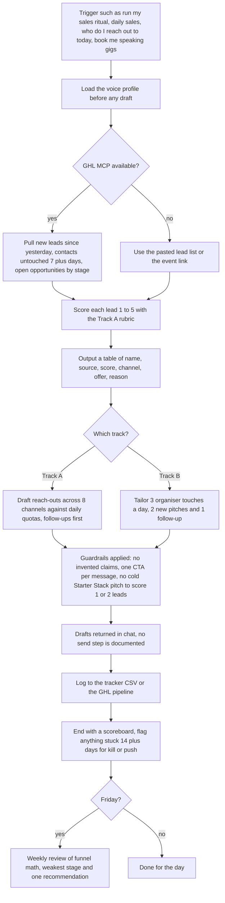

# sales-engine (daily outbound sales ritual skill)

> A Claude skill that runs the owner's 45-60 minute daily sales ritual: score leads, draft multi-channel reach-outs against daily quotas, track follow-ups, and pitch paid speaking gigs.

| | |
|---|---|
| **Category** | Claude skills (sales) |
| **Status** | On demand, as of 9 Oct 2026 |
| **Type** | Claude skill (`SKILL.md` playbook with reference files and a tracker template) |
| **Runner and schedule** | Manual, invoked in chat. No scheduled task found. The `sales-call-report` routine is a separate prompt, not this skill. |
| **Client / owner** | P2T and HLGP (Track A); the owner's personal speaker brand (Track B) |
| **Stack** | Claude skill; GHL MCP connector (optional); reference markdown files; CSV tracker template |
| **Source** | Main KB Part 8 sales-engine section (lines 4693-4702) and summary table (line 4533); Portfolio KB sections 27-28 (lists the skill by name only) |

## 1. Description

### What it does
`sales-engine` is the owner's daily outbound ritual, run in two tracks. Track A sells the "AI Agency in a Box" offer for P2T and HLGP (ladder: a $500 POWER PIVOT audit as the entry, a $9,997 AI Agency Starter Stack as the core, and an HLGP white-label fulfilment retainer as the backend). Track B books paid speaking gigs for the owner's personal brand by pitching event organisers. Each day it scores the leads, drafts the reach-outs against quotas, and ends with a scoreboard; on Fridays it adds a weekly review.

### Inputs and outputs
- **Inputs:** GHL data when the MCP is available (new leads since yesterday, contacts untouched for 7 or more days, open opportunities by stage), otherwise a pasted lead list; for Track B, event names or a conference link. `references/voice-profile.md` must be loaded before any draft.
- **Outputs:** a scored lead table (name, source, score, channel, offer, reason), drafted messages, a tracker update, a scoreboard, and a Friday weekly review (funnel math, weakest stage, one recommendation).

### Key components
| Component | Role |
|---|---|
| `SKILL.md` | The ritual: pull and score, draft, Track B, log and scoreboard |
| `references/track-a-agency-in-a-box.md` | Offer ladder and the 1-5 lead-scoring rubric (5 = asked price or timeline, down to 1 = unclear fit) |
| Track B reference | Paid-speaking pitch guidance (file name not stated in the source) |
| `references/voice-profile.md` | Voice rules; loaded before any draft |
| `assets/daily-tracker-template.csv` | Where each day's activity is logged (or the GHL pipeline is used instead) |
| GHL MCP | Optional source of live lead and opportunity data |

### Where it lives
User-level skill folder `C:\Users\<user>\.claude\skills\sales-engine\` (file stamp 2026-09-01, a bulk-import stamp). The synced copy under `skills\synced\...` is identical (SHA-256 match). The skill does not use a scheduled task.

## 2. Flow chart

**Reading the chart**
1. The ritual starts on a trigger phrase or a pasted lead list or conference link.
2. The voice profile is loaded first so every draft sounds like the owner.
3. Lead data comes from GHL when the connector is available, otherwise from the list the owner pastes.
4. Each lead is scored 1-5 and shown in a table with channel, offer and a reason.
5. Track A drafts reach-outs against daily quotas (email 5 new and 5 follow-ups, LinkedIn 5, WhatsApp or SMS 3, Instagram 3, Facebook groups, YouTube comments, 1 BNI or referral ask, 1 Loom or voice note). Follow-ups go before new outreach; the follow-up cadence is Day 0, 2, 5, 9, 14, 21, then monthly.
6. Track B drafts three organiser touches a day, tailored per event.
7. Guardrails apply to every draft before it is handed back; the KB documents no automated sending.
8. The day is logged, ended with a scoreboard, and stuck items are flagged. Fridays add the weekly review.

## 3. Case study

### The challenge
Outbound for a small agency owner is spread across many channels and two very different offers (an agency-building package and paid speaking). Without a routine, leads go cold and follow-ups slip. The KB does not record the specific business problem that led to the skill, so this challenge is read from the skill's own design (inferred).

### The solution
A single skill that turns the day's lead data into a prioritised list and ready-to-edit drafts, with fixed quotas per channel, a follow-up cadence, and an end-of-day scoreboard. Voice rules live in a reference file so drafts do not sound machine-written. GHL data is used when it is connected, but the ritual still works from a pasted list.

### Design decisions and rules learned
- No fabricated claims, testimonials or numbers: use brackets as placeholders.
- No em-dashes and no AI-sounding language; one CTA per message.
- Never pitch the Starter Stack cold to score 1-2 leads.
- Push back with margin math before any discount below the floor price. The floor is a `[confirm]` placeholder in the reference, not a recorded number.
- Never guarantee income. A payment plan is the concession, not a lower price.
- Follow-ups before new outreach; anything stuck 14 or more days gets a kill-or-push decision.

### Outcome
No measured outcome recorded. The source documents the skill's design, not results (no reply rates, bookings or revenue).

### Lessons learned
- Keeping quotas, cadence and guardrails in the skill makes the daily run repeatable.
- Leaving a price floor as a placeholder avoids a stale number being quoted, but it means the discount rule cannot be enforced until it is filled.

## 4. Operating notes
- **Run / pause / debug:** Say a trigger phrase in chat ("run my sales ritual", "daily sales", "sales engine", "draft my reach-outs", "pitch me to this event"). There is nothing to pause because nothing is scheduled.
- **Known issues and open items:** No schedule was found, so it is treated as manual. The price floor placeholder is unfilled in the reference. The Track B reference file name is not recorded.
- **Risks:** It reads GHL contacts and opportunities, so lead data enters the chat. BNI appears in the skill only as a referral channel.

## 5. Related
- [Skills overview](00-skills-overview.md)
- [priya-business-advisor](priya-business-advisor.md) hands execution work such as outbound to this skill.
- [sales-call-report-dashboard](../01-scheduled-tasks-reporting/sales-call-report-dashboard.md): the separate `sales-call-report` routine, which is not this skill.
- **Sources:** Main KB Part 8 lines 4533 and 4693-4702; Portfolio KB sections 27-28.
