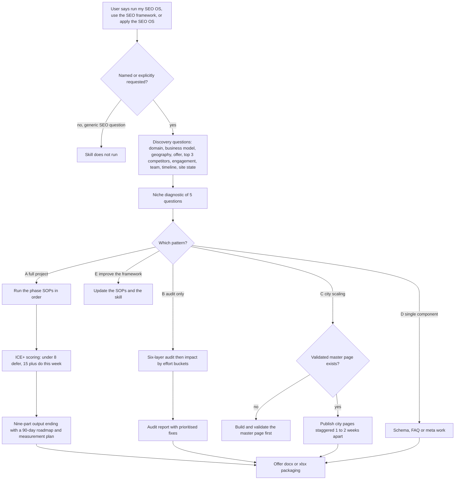

# seo-os (SEO Operating System skill)

> A Claude skill that runs a repeatable six-phase SEO framework for any niche, city or client, built from the HL Growth Partner reference project and invoked only by name.

| | |
|---|---|
| **Category** | Claude skills (SEO) |
| **Status** | On demand, as of 9 Oct 2026 |
| **Type** | Claude skill (orchestrator `SKILL.md` plus six Word SOP documents) |
| **Runner and schedule** | Manual, and only on explicit invocation ("run my SEO OS"). It must not auto-trigger on generic SEO questions. |
| **Client / owner** | P2T and HLGP (the HL Growth Partner project is the reference build); applied to any client niche or city |
| **Stack** | Claude skill; six `.docx` phase SOPs read on demand with `extract-text`; docx and xlsx skills for packaging; no connectors |
| **Source** | Main KB Part 8 seo-os section (lines 4704-4713) and summary table (line 4534); Part 2 section 16 (lines 1283-1313); Portfolio KB sections 27-28 (name only) |

## 1. Description

### What it does
`seo-os` is the SEO Operating System: a six-phase framework (Discovery and Research; Strategy and Roadmap; Technical SEO; Content Optimization; Local SEO plus Off-Page; Scaling plus Auditing) that can be repeated across niches, cities and clients. The `SKILL.md` is only an orchestrator. It identifies which of five patterns the request fits, asks the discovery questions, runs a niche diagnostic, then reads the relevant phase SOP document and works through it.

### Inputs and outputs
- **Inputs:** discovery answers (domain and business model, geography, primary offer, top 3 competitors, engagement type, team size, timeline, site state), then a 5-question niche diagnostic (sales cycle, compliance layer, authority signals, dominant SERP feature, the customer's biggest fear).
- **Outputs:** executive summary, page inventory, 90-day roadmap with a measurement plan, schema specs, content briefs, and local and off-page actions; the skill offers docx or xlsx packaging. For the audit-only pattern the output is an audit report with prioritised fixes (Part 2 section 16 lists "audit report, prioritised fixes, 90-day roadmap" for this skill and `website-audit` together).

### Key components
| Component | Role |
|---|---|
| `SKILL.md` | Orchestrator: trigger rule, discovery questions, five patterns, rules |
| Six phase SOPs (`.docx`) | Discovery and Research; Strategy and Roadmap; Technical SEO; Content Optimization; Local SEO plus Off-Page; Scaling plus Auditing. Read on demand with `extract-text` |
| ICE+ scoring | Prioritisation on Intent, Competition, Effort and Strategic fit. Under 8 = defer, 15 or more = do this week |
| Five patterns | A full project; B audit only; C city-page scaling; D single component (schema, FAQ, meta); E improve the framework |
| docx and xlsx skills | Packaging the deliverables |

### Where it lives
`C:\Users\<user>\.claude\skills\seo-os\` (SKILL.md and the six SOP `.docx` files, all stamped 2026-09-01, a bulk-import stamp). Whether a synced copy exists or matches is not documented in the source.

## 2. Flow chart

**Reading the chart**
1. The skill runs only when the owner names it; a generic SEO question does not start it.
2. Discovery questions fix the scope: site, offer, geography, competitors, engagement type, team and timeline.
3. The 5-question niche diagnostic captures what is distinctive about the niche (sales cycle, compliance, authority signals, SERP feature, buyer fear).
4. One of five patterns is chosen. A runs the full six phases; B is an audit across six layers (crawlability, indexability, on-page, content quality, off-page, performance) sorted into impact-by-effort buckets; C scales city pages; D handles one component; E updates the framework itself.
5. City scaling needs a validated master page first and publishes staggered 1-2 weeks apart; bulk-publishing 20 city pages in 2 weeks is pushed back on.
6. For a full project, ICE+ scoring orders the work and the output is nine parts ending in a 90-day roadmap and measurement plan.
7. Deliverables can be packaged as docx or xlsx on request.

## 3. Case study

### The challenge
SEO work for different clients and cities tends to be rebuilt from scratch each time and drifts toward bulk page publishing without proof. The owner wanted the approach proven on the HL Growth Partner project to be repeatable for any niche. The KB does not record a specific client problem behind the skill (the framing here is read from the skill's description).

### The solution
A skill that is deliberately thin: the SKILL.md routes the request, and the depth sits in six Word SOPs, one per phase, loaded only when needed. A fixed discovery step and a niche diagnostic make sure each engagement starts from the same facts. The five patterns allow a small request (a schema block) or a full project to use the same framework.

### Design decisions and rules learned
- Strategy before pages; technical foundation before content.
- Never fabricate proof.
- AI search readiness is mandatory in 2026: AI bot allowlist in `robots.txt`, FAQ content structured for extraction, schema beyond Organization, and an AI-presence audit.
- Be ruthless about scope; push back on publishing many city pages quickly.
- Explicit invocation only, so the heavy framework does not fire on a casual SEO question.

### Outcome
No measured outcome recorded. The source documents the framework and its triggers, not rankings or results from applying it.

### Lessons learned
- An orchestrator plus on-demand SOP documents keeps the skill small while retaining depth.
- Staggering city-page publishing and validating a master page first are stated as rules, which suggests earlier bulk publishing was a risk (inferred).

## 4. Operating notes
- **Run / pause / debug:** Invoke by name in chat ("run my SEO OS", "apply the SEO OS"). Nothing is scheduled. The lightweight GHL-specific companion is the September 2026 sitemap script set (Part 2 section 15).
- **Known issues and open items:** The six `.docx` SOPs were not read in depth by the KB author, so their step-level content is not summarised here. Synced-copy status is not documented.
- **Risks:** None recorded beyond scope creep; the skill itself guards against it.

## 5. Related
- [Skills overview](00-skills-overview.md)
- [website-audit](website-audit.md): the scripted audit that supplies measured data for the audit-only pattern.
- [p2t-sitemap-audit-and-url-finder](../02-content-seo-newsletters/p2t-sitemap-audit-and-url-finder.md): the lightweight GHL-specific sitemap tooling.
- [landing-page-blueprint-31-pages](../02-content-seo-newsletters/landing-page-blueprint-31-pages.md): the 31-page SEO landing-page set that sits beside this framework in Part 2.
- **Sources:** Main KB Part 8 lines 4534 and 4704-4713; Part 2 section 16 lines 1283-1313; Portfolio KB sections 27-28.
