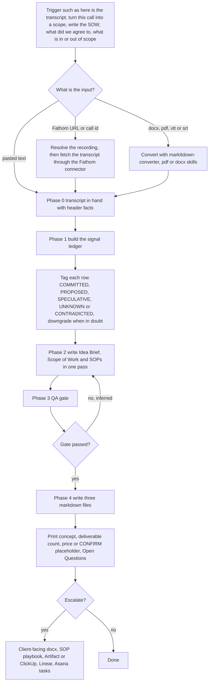

# transcript-to-scope-sop (call transcript to Idea Brief, Scope of Work and SOPs)

> A Claude skill that turns any call transcript into three linked, evidence-backed documents: a Project Idea Brief, a defensible Scope of Work and delivery SOPs, separating what was committed from what was merely floated.

| | |
|---|---|
| **Category** | Claude skills (scoping and documentation) |
| **Status** | On demand, as of 9 Oct 2026 |
| **Type** | Claude skill with three templates, a QA gate reference and an `evals/evals.json` test file |
| **Runner and schedule** | Manual, invoked in chat when a transcript or meeting link is supplied. No schedule. |
| **Client / owner** | P2T and HLGP delivery work; internal by default, client-facing mode available |
| **Stack** | Claude skill; Fathom connector; markitdown-converter, pdf and docx skills for file inputs |
| **Source** | Main KB Part 8 transcript-to-scope-sop section (lines 4660-4669) and summary table (line 4530); Portfolio KB sections 27-28 (name only) |

## 1. Description

### What it does
`transcript-to-scope-sop` turns a call transcript into three linked deliverables: a Project Idea Brief, a Scope of Work that can be defended, and delivery SOPs. Its guiding discipline is that every deliverable, date, price and owner must trace to a quote, and that what was committed is kept apart from what was proposed, speculated or contradicted.

### Inputs and outputs
- **Inputs:** a Fathom URL or call id (resolved with `get_recording_by_url` or `get_recording_by_call_id`, then `get_meeting_transcript`), pasted text, or converted `.docx`, `.pdf`, `.vtt` or `.srt` files; header facts (date, participants and roles, client side versus delivery side). Transcripts from Zoom, Teams, Otter, Fireflies or Granola are also accepted.
- **Outputs:** three markdown files, `<slug>-idea-brief.md`, `<slug>-scope-of-work.md` and `<slug>-sops.md`, plus a printed summary (concept, deliverable count, price or `[CONFIRM: price]`, and Open Questions). Optional escalation to a client-facing docx, the p2t-sop-writer playbook, an Artifact, or ClickUp, Linear or Asana tasks.

### Key components
| Component | Role |
|---|---|
| Phase 0 to 4 workflow | Get transcript, signal ledger, write three documents, QA gate, write files |
| Signal ledger | Rows for outcome, pain, deliverables, exclusions, money, dates, people, access and tools, decisions, risks and verbatim client language, each tagged COMMITTED, PROPOSED, SPECULATIVE, UNKNOWN or CONTRADICTED |
| `references/idea-brief-template.md`, `scope-of-work-template.md`, `sop-format.md` | Templates for the three documents |
| `references/qa-gate.md` | The pre-write quality check |
| Three modes | Internal (default), client-facing (every `[CONFIRM]` stays visible), multi-call (most recent statement wins but the conflict is listed) |
| `evals/evals.json` | Test cases; results not recorded in the source |

### Where it lives
`C:\Users\<user>\.claude\skills\transcript-to-scope-sop\` (SKILL.md stamped 2026-09-01 19:37, references 19:38-19:40, a bulk-import stamp). Whether a synced copy exists or matches is not documented in the source.

## 2. Flow chart

**Reading the chart**
1. A transcript, meeting link or scope question starts the skill.
2. A Fathom link or call id is resolved to a recording and then to its transcript; pasted text is used as is; other file types are converted first.
3. The signal ledger lists everything raised in the call and tags each row; when in doubt, the tag is downgraded.
4. All three documents are written in one pass from the ledger using the templates.
5. The QA gate checks the draft before files are written. The KB does not describe what happens on a failure; the loop back to writing is an assumption (inferred).
6. Three markdown files are saved and a short summary with Open Questions is printed.
7. Escalation to client-facing or task-system formats is optional.

## 3. Case study

### The challenge
The skill is built on the principle "discipline over prose": separate what was committed from what was merely floated. A call transcript contains commitments, proposals, speculation and contradictions, and a scope document that treats them all as agreed is not defensible. The KB records the design, not a specific dispute.

### The solution
A phased skill. First a signal ledger captures everything and tags its certainty. Then the three documents are written together so they stay consistent. A QA gate and a mandatory Out-of-Scope list guard the result, and Open Questions carry any ambiguity forward rather than resolving it silently.

### Design decisions and rules learned
- Evidence or it does not exist: every deliverable, date, price and owner traces to a quote.
- Never invent a number: use `[CONFIRM: ...]` placeholders.
- Ambiguity is surfaced in Open Questions, not resolved.
- The Out-of-Scope list is mandatory.
- Multi-call mode: the most recent statement wins, but the conflict is listed.
- Client-facing mode keeps every `[CONFIRM]` visible.

### Outcome
No measured outcome recorded. The source documents the workflow and rules, not scopes produced; `evals/evals.json` exists but no results are recorded.

### Lessons learned
- Tagging certainty row by row is what makes a scope defensible later.
- Writing all three documents in one pass keeps the brief, scope and SOPs from contradicting each other.

## 4. Operating notes
- **Run / pause / debug:** Invoke in chat with a transcript, Fathom URL or call id. Nothing is scheduled. For file inputs, install and use `markitdown-converter` (named in Phase 0).
- **Known issues and open items:** None recorded beyond the QA-gate failure path being undocumented.
- **Risks:** Transcripts carry client conversation content; keep outputs internal unless the client-facing mode is chosen deliberately.

## 5. Related
- [Skills overview](00-skills-overview.md)
- [markitdown-converter](markitdown-converter.md): converts file inputs in Phase 0.
- [p2t-sop-writer](p2t-sop-writer.md): destination for escalated delivery SOPs.
- [project-scope-tracker](project-scope-tracker.md): the sibling skill that turns a transcript and proposal into a client-facing tracker.
- **Sources:** Main KB Part 8 lines 4530 and 4660-4669; Portfolio KB sections 27-28.
