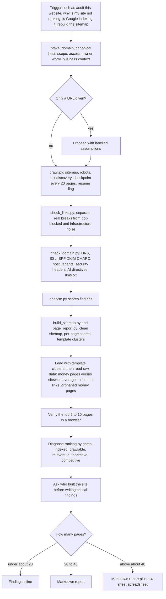

# website-audit (scripted four-lens website audit skill)

> A Claude skill that crawls a live website with bundled Python scripts and produces an evidence-based, scored, page-by-page audit through four lenses: developer, QA tester, SEO specialist and business owner.

| | |
|---|---|
| **Category** | Claude skills (SEO and site quality) |
| **Status** | On demand, as of 9 Oct 2026 |
| **Type** | Claude skill with six Python scripts and report references |
| **Runner and schedule** | Manual, invoked in chat. No schedule. |
| **Client / owner** | P2T and HLGP; applied to any site the owner is asked to audit |
| **Stack** | Python (requests, beautifulsoup4, lxml, dnspython); optional browser (Chrome extension or Playwright) for verification; xlsx skill for spreadsheets |
| **Source** | Main KB Part 8 website-audit section (lines 4715-4724) and summary table (line 4535); Part 2 section 16 (lines 1283-1313); Portfolio KB sections 27-28 (name only) |

## 1. Description

### What it does
`website-audit` audits any live website for indexation, broken links, images and buttons, redirects, forms, metadata, schema, DNS, SSL and email authentication, AI-crawler readiness, duplicate and orphan pages, and why the site is not ranking. It then rebuilds a clean sitemap and scores every page. It is for websites, not CRM accounts; GoHighLevel accounts use `ghl-account-audit`.

### Inputs and outputs
- **Inputs:** domain and intended canonical host, scope, access limits, the owner's worry in their own words, and business context. If only a URL is given, the skill proceeds with labelled assumptions.
- **Outputs:** findings in a size-dependent format: inline under about 20 pages, markdown for 20-40 pages, markdown plus a 4-sheet spreadsheet above about 40 (Summary, All Pages, Priority Fixes sorted by inbound links, Check Matrix). Working files: `crawl.json`, `links.json`, `domain.json`, `findings.json` and `findings.md`, `sitemap.xml`, `pages.json`, `pages.md` and `pages.csv`. Part 2 section 16 summarises the deliverables as an audit report, prioritised fixes, a 90-day roadmap and a rebuilt sitemap.

### Key components
| Component | Role |
|---|---|
| `crawl.py` | Sitemap, robots and link discovery; checkpoints every 20 pages; `--resume` |
| `check_links.py` | Checks links, images, scripts and styles; separates real breaks from bot-blocked and infrastructure noise |
| `check_domain.py` | DNS, SSL, SPF/DKIM/DMARC, canonical host variants, security headers, robots AI directives, `llms.txt` |
| `analyse.py` | Scored findings |
| `build_sitemap.py` | Rebuilds a clean sitemap |
| `page_report.py` | Per-page scores and template clusters |
| `references/report-template.md`, `references/ranking-diagnosis.md` | Report structure and the ranking-gates method |

### Where it lives
`C:\Users\<user>\.claude\skills\website-audit\` (stamp 2026-09-01, a bulk-import stamp). The synced copy under `skills\synced\...` is identical (SHA-256 match).

## 2. Flow chart

**Reading the chart**
1. The audit starts when the owner asks to audit or check a site, asks why it is not ranking or indexed, asks whether links or the domain connection work, or pastes a domain or URL list.
2. Intake captures the domain, scope, access limits and the owner's worry; with only a URL it proceeds on labelled assumptions.
3. `crawl.py` gathers the pages (sitemap, robots, links) and saves progress every 20 pages so it can resume.
4. `check_links.py` and `check_domain.py` measure link health and the domain, SSL, email-authentication and header posture.
5. `analyse.py`, `build_sitemap.py` and `page_report.py` turn the data into scored findings, a clean sitemap and per-page scores grouped into template clusters.
6. The report leads with template clusters because one template fix moves many pages, then reads the raw data and checks the top pages in a real browser.
7. Ranking problems are diagnosed through five gates, and the skill asks who built the site before it writes critical findings.
8. The output format scales with the number of pages.

## 3. Case study

### The challenge
Requests like "why isn't my site ranking?" or "is Google indexing it?" need evidence rather than opinion. The skill's own rules show the traps it guards against: raw broken-link counts that include bot-blocked and infrastructure noise, and estimates where a number could have been measured. The KB does not tell a specific client story behind the skill.

### The solution
A script-backed audit workflow. Collectors do the measuring (crawl, links, domain), analysis scripts score and cluster, and the model interprets the numbers into a report. Verification in a browser covers what scripts cannot see, because the scripts read server-rendered HTML only (AI crawlers also do not run JavaScript).

### Design decisions and rules learned
- Measure then judge: never estimate a number you could measure, never report a number without a judgement.
- Never report the unfiltered broken-link number; filter bot-blocked and infrastructure noise first.
- Score on a saturating curve: 0-39 Critical, 40-59 Underbuilt, 60-79 Functional, 80-100 Strong. Weights: Infrastructure 20, Crawl 20, Technical SEO 20, Functional/QA 15, Content 15, Trust 10.
- Be a good citizen: `--delay` 0.15 or more and 14 workers or fewer.
- Never audit a site the owner was not asked to audit; lead with what works.
- Ask who built the site before writing critical findings (Part 2 section 16).

### Outcome
No measured outcome recorded. The source describes the workflow and report formats, not an audit result.

### Lessons learned
- Lead with template clusters: fixing one template improves many pages.
- Money pages must be read against sitewide averages, and orphaned money pages are a distinct finding.
- Scripts miss client-rendered content, so a browser check of the top pages is part of the method.

## 4. Operating notes
- **Run / pause / debug:** Invoke in chat with a domain. The crawl checkpoints every 20 pages and resumes with `--resume`. Keep `--delay` at 0.15 or more and workers at 14 or fewer.
- **Known issues and open items:** The six scripts were not read in depth by the KB author, so their internals are not described here. Scripts see only server-rendered HTML.
- **Risks:** Crawling a site that was not requested; the skill states it must not do this. A heavy crawl can load the target site if the delay and worker limits are ignored.

## 5. Related
- [Skills overview](00-skills-overview.md)
- [seo-os](seo-os.md): the strategy framework; its audit-only pattern uses this kind of evidence.
- [p2t-sitemap-audit-and-url-finder](../02-content-seo-newsletters/p2t-sitemap-audit-and-url-finder.md): the lightweight GHL-specific sitemap scripts (Part 2 section 15).
- [ghl-account-audit](../03-ghl-crm-migrations/ghl-account-audit.md): the audit for GoHighLevel accounts rather than websites.
- **Sources:** Main KB Part 8 lines 4535 and 4715-4724; Part 2 section 16 lines 1283-1313; Portfolio KB sections 27-28.
