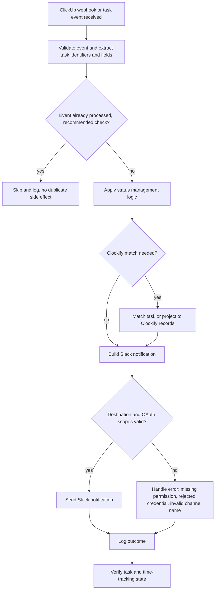

# ClickUp, Slack and Clockify integration

> Connects ClickUp task events to task-status handling, Clockify time-tracking records and Slack team notifications, as described in the portfolio knowledge base.

| | |
|---|---|
| **Category** | Integrations and operations |
| **Status** | Reference, as of 9 Oct 2026. Portfolio KB label: User-confirmed completed (live state not verified in any source) |
| **Type** | Event-driven integration, webhook-triggered (the automation tool is not named for this item) |
| **Runner and schedule** | Not documented in the source. Trigger is a ClickUp webhook or task event, so no fixed schedule |
| **Client / owner** | Owner: Hari. Client or workspace: not documented in the source |
| **Stack** | ClickUp (webhooks), Slack (OAuth app), Clockify, a spreadsheet used for time-tracking matching |
| **Source** | Portfolio KB section 4 (lines 114-159), plus its sections 29-34 (reusable patterns) and Part VI checklist. Main KB: no process found, see "Where it lives" |

## 1. Description

### What it does
Receives a ClickUp webhook or task event, validates it, applies status-management logic, matches the task or project to Clockify records where required, and sends the right Slack notification. It then logs the outcome and checks the resulting task and time-tracking state (portfolio KB).

### Inputs and outputs
- **Inputs:** ClickUp webhook or task event with task identifiers and fields; Clockify project and task data; spreadsheet rows used for time-tracking matching.
- **Outputs:** Slack notifications, an updated task status and time-tracking association, and a log of the outcome.

### Key components
| Component | Role |
|---|---|
| `Status Manager Native (Credential-based Auth)` | Named component in the portfolio KB for task status management, using stored credentials |
| ClickUp webhook processing | Receives and validates task events |
| Clockify integration and project/task matching | Links a task or project to the correct Clockify records, see [clockify-project-task-matching.md](clockify-project-task-matching.md) |
| Spreadsheet-based time-tracking matching | Ties Clockify records to spreadsheet rows |
| Slack notifications | Tells the team what changed, see [slack-team-notifications.md](slack-team-notifications.md) |

### Where it lives
Not documented in the source. The portfolio KB asks for a "ClickUp/Slack/Clockify workflow export" in its Part VI source-of-truth checklist, which implies a workflow exists, but it names no tool, file path, repository or environment variables. The main KB (read from real files and transcripts) holds no ClickUp or Clockify workflow, script or folder. ClickUp appears there only as a configured Claude connector with 0 calls (Part 7, connectors table) and as an optional hand-off target in the `transcript-to-scope-sop` skill (Part 8). Neither is this integration.

## 2. Flow chart

Documented general process from the portfolio KB, not a recorded run. The duplicate-event check is a recommended control in the source, not a confirmed part of the build.

**Reading the chart**
1. A ClickUp webhook or task event arrives and is validated; task identifiers and relevant fields are extracted.
2. Recommended control: events that were already handled are skipped so webhook retries cause no duplicate side effects.
3. Status-management logic runs on the task.
4. Where required, the task or project is matched to Clockify records (matching rules are in the linked file).
5. A Slack message is built, and its destination and permissions are checked.
6. On success the notification is sent; on failure the error (permission, credential, channel name) is handled.
7. The outcome is logged and the resulting task and time-tracking state is verified.

## 3. Case study

### The challenge
Task workflow events, team notifications and time tracking lived in three tools. Each ClickUp status change needed to reach the team in Slack and keep Clockify and the tracking spreadsheet consistent (portfolio KB, Purpose).

### The solution
A webhook-driven integration with a status manager, a Clockify matching step and Slack messaging, finished and confirmed by the owner. The portfolio KB records only the general process; the exact nodes, endpoints and mappings are not in the source.

### Design decisions and rules learned
- Store tokens in credentials or secrets, never in workflow code. The component name `Status Manager Native (Credential-based Auth)` points the same way.
- Request only the OAuth scopes required, and validate Slack channel names before calling the API.
- Handle webhook retries without duplicate side effects.
- Keep a stable mapping between ClickUp tasks, Clockify projects and tasks, and spreadsheet rows.

### Outcome
Status: user-confirmed completed (portfolio KB). No run counts, dates, volumes or time savings are recorded.

### Lessons learned
Troubleshooting history in the portfolio KB lists three kinds of Slack problem: a missing OAuth permission, a rejected credential, and an invalid channel name. The source does not say how each was resolved.

## 4. Operating notes
- **Run / pause / debug:** Not documented in the source.
- **Known issues and open items:** The three Slack problems above are history; whether any recur is not recorded.
- **Risks:** An invalid Slack credential stops notifications. Slack retries or ClickUp webhook retries can produce duplicate messages unless an idempotency key exists (recommended in the source, unconfirmed).
- **Documentation still needed:**
  - [ ] Workflow export or script, and the tool it runs in
  - [ ] ClickUp events subscribed and the status-management rules
  - [ ] Slack channels, message wording and required scopes
  - [ ] Mapping table of ClickUp tasks, Clockify projects and tasks, and spreadsheet rows
  - [ ] Credential names and renewal steps (names only)
  - [ ] Where logs are kept and how reruns work

## 5. Related
- [clockify-project-task-matching.md](clockify-project-task-matching.md)
- [slack-team-notifications.md](slack-team-notifications.md)
- **Sources:** Portfolio KB sections 4, 5, 13, 29-34 and Part VI. Main KB Part 7 (connectors table) and Part 8 (`transcript-to-scope-sop`) checked for ClickUp and Clockify, no integration evidence found.
