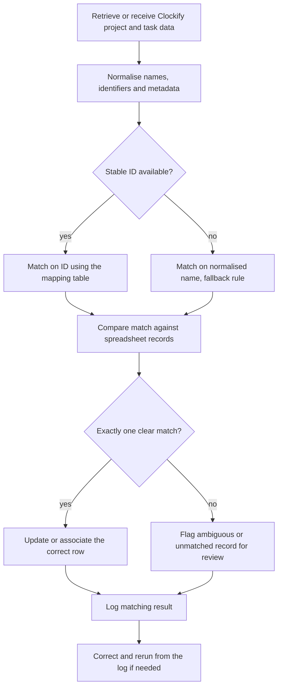

# Clockify project and task matching

> Matches Clockify projects and tasks to the correct spreadsheet records so time tracking and operational reporting line up.

| | |
|---|---|
| **Category** | Integrations and operations |
| **Status** | Reference, as of 9 Oct 2026. Portfolio KB label: User-confirmed completed (live state not verified in any source) |
| **Type** | Matching and reconciliation step (a module of the ClickUp, Slack and Clockify integration) |
| **Runner and schedule** | Not documented in the source |
| **Client / owner** | Owner: Hari. Client or workspace: not documented in the source |
| **Stack** | Clockify project and task data, a spreadsheet of time-tracking records |
| **Source** | Portfolio KB section 5 (lines 162-187), and the "Related components" list in section 4. Main KB: no Clockify content found |

## 1. Description

### What it does
Retrieves or receives Clockify project and task data, normalises names and identifiers, and matches each item to the right spreadsheet record. Stable IDs are used wherever possible; normalised names are a fallback only. Ambiguous or unmatched items are flagged for review and every result is logged so corrections and reruns are possible (portfolio KB).

### Inputs and outputs
- **Inputs:** Clockify project and task data (retrieved or received); spreadsheet records; a mapping table of IDs.
- **Outputs:** Updated or associated spreadsheet rows, a list of ambiguous or unmatched records, and a matching log.

### Key components
| Component | Role |
|---|---|
| Clockify project and task data | Source of identifiers, names and metadata |
| Mapping table | Holds stable IDs so matches survive name changes (design rule in the source) |
| Fallback rules | Normalised-name matching, used only where IDs are unavailable |
| Spreadsheet records | Destination for the matched time-tracking data |
| Review list and log | Surface ambiguous matches and support correction and reruns |

### Where it lives
Not documented in the source. No script, sheet name, workflow export or credential names are recorded. It is listed as a related component of [clickup-slack-clockify-integration.md](clickup-slack-clockify-integration.md).

## 2. Flow chart

Documented general process from the portfolio KB, not a recorded run.

**Reading the chart**
1. Clockify project and task data is retrieved or received.
2. Names, IDs and metadata are normalised.
3. If a stable ID exists, the match is made on that ID via the mapping table.
4. If not, the fallback is a normalised-name match.
5. The match is compared against the spreadsheet records.
6. A single clear match updates or associates the correct row; anything else is flagged for review.
7. All results are logged so errors can be corrected and the run repeated.

## 3. Case study

### The challenge
Time entries in Clockify had to land against the right rows of a spreadsheet used for time tracking and operational reporting. Project and task display names can change or collide, so name-only matching would silently link the wrong records.

### The solution
A matching step that prefers immutable IDs, keeps a mapping table, falls back to normalised names only when IDs are missing, and routes anything uncertain to a human instead of guessing. The portfolio KB describes the general process only.

### Design decisions and rules learned
- Do not rely exclusively on display names, because names can change or collide. Prefer immutable IDs and keep a mapping table (design rule stated in the source).
- Flag ambiguous and unmatched records rather than forcing a match.
- Log every match so errors can be corrected and reruns are safe.
- The same "stable key, not a display name" idea appears elsewhere in the main KB, for example the lower-case-email-plus-week-ending key in the Scope Stainless timesheet (Part 5 s1-2). That is a different system and the main KB does not connect it to Clockify.

### Outcome
Status: user-confirmed completed (portfolio KB). No match rates, record counts or dates are recorded.

### Lessons learned
- Names are not identifiers.
- Unmatched items need a visible review path, not a silent skip.
- Keep the mapping between ClickUp tasks, Clockify projects and tasks, and spreadsheet rows stable (source, section 4).

## 4. Operating notes
- **Run / pause / debug:** Not documented in the source.
- **Known issues and open items:** None recorded beyond the missing detail below.
- **Risks:** A renamed or duplicated Clockify project could be mis-matched if the mapping table is stale or missing.
- **Documentation still needed:**
  - [ ] Spreadsheet name, tab and column layout
  - [ ] The mapping table and who maintains it
  - [ ] The exact fallback rules and how ties are reported
  - [ ] Whether matching runs on every event or on a schedule
  - [ ] Where the match log is kept

## 5. Related
- [clickup-slack-clockify-integration.md](clickup-slack-clockify-integration.md)
- [scope-stainless-works-digital-timesheet.md](../05-excel-workflow-tools/scope-stainless-works-digital-timesheet.md) (only a comparable key-based design, not connected to Clockify)
- **Sources:** Portfolio KB sections 4 and 5. Main KB searched for "Clockify": no occurrences.
