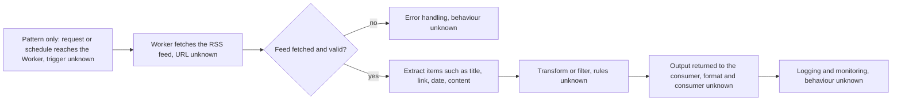

# Cloudflare Worker for Spotify RSS

> A Cloudflare Worker script that processes Spotify RSS-related content; the portfolio knowledge base confirms it existed but records almost nothing else.

| | |
|---|---|
| **Category** | Integrations and operations |
| **Status** | Reference, as of 9 Oct 2026. Portfolio KB label: User-confirmed completed (script existence only; deployment and consumers not recorded) |
| **Type** | Cloudflare Worker (serverless script) |
| **Runner and schedule** | Cloudflare Workers per the title; trigger, URL and schedule not documented in the source |
| **Client / owner** | Owner: Hari. Client or purpose: not documented in the source |
| **Stack** | Cloudflare Workers, Spotify RSS feed (as named in the source) |
| **Source** | Portfolio KB section 7 (lines 233-257) and Part VI checklist. Main KB: no Worker, no Spotify RSS content found |

## 1. Description

### What it does
The portfolio KB says only that a Cloudflare Worker is used "to process Spotify RSS-related content". It states that the script's existence was discussed but that the exact endpoints, transformations, deployment settings and consumers are not in the conversation history, and that these details must not be invented. This file therefore records what is known and lists what must be added.

### Inputs and outputs
- **Inputs:** Not documented in the source (the RSS URL or URLs are unknown).
- **Outputs:** Not documented in the source (output format and consumers are unknown).

### Key components
| Component | Role |
|---|---|
| Cloudflare Worker script | Processes Spotify RSS-related content. Name, production URL and code location are unknown |

### Where it lives
Not documented in the source. The portfolio KB's Part VI checklist asks for "Cloudflare Worker source and deployment configuration" to be attached. The main KB has no Worker project, no `wrangler` configuration and no Spotify feed. Two nearby mentions are unrelated:
- Cloudflare "Error 1010" in the main KB is a user-agent block in front of the GHL API, not a Worker (Part 3 s16).
- A roughly 150-line Cloudflare Worker appears in the main KB only as a design for the ServiceM8 to GHL sync (Part 5 s3), not Spotify. See [servicem8-ghl-two-way-sync-blueprint.md](../03-ghl-crm-migrations/servicem8-ghl-two-way-sync-blueprint.md).

## 2. Flow chart

Documented pattern, details not in source. This is the generic "RSS in, Worker, output out" shape built from the portfolio KB's RSS and standard-workflow sections (6 and 29). It is NOT the recorded design of this Worker; every step marked "unknown" must be filled from the actual script.

**Reading the chart**
1. Something calls the Worker or a schedule fires it. The source does not say which.
2. The Worker fetches a Spotify RSS feed. The URL or URLs are unknown.
3. A failed or invalid fetch goes to error handling, whose behaviour is unknown.
4. Items are read from the feed. The fields named here (title, link, date, content) come from the portfolio KB's generic RSS process, not from this Worker.
5. Any transformation or filtering is unknown.
6. The result goes to a consumer in some output format. Both are unknown.
7. Whether anything is logged or monitored is unknown.

## 3. Case study

### The challenge
Not documented in the source. The portfolio KB gives no business problem for this Worker.

### The solution
A Cloudflare Worker script, confirmed as completed by the owner. Its behaviour, endpoints and deployment were not captured in the conversation history behind the portfolio KB.

### Design decisions and rules learned
- Do not invent endpoints, transformations or consumers for this Worker (the source's own warning).
- Treat RSS content as untrusted input (portfolio KB section 6, general RSS safeguard).
- Keep secrets out of the script and record environment variable names only (portfolio KB section 32, general rule).

### Outcome
No measured outcome recorded. Only the existence of the script is confirmed.

### Lessons learned
A script that is "completed" but not written down cannot be reproduced, maintained or shown as a case study. The portfolio KB itself warns that a project is not proven deployed just because a script exists (section 36).

## 4. Operating notes
- **Run / pause / debug:** Not documented in the source.
- **Known issues and open items:** All implementation detail is missing.
- **Risks:** An undocumented Worker may have secrets, routes or consumers nobody remembers. Anything depending on its output could break unnoticed.
- **Documentation still needed (from the portfolio KB's own list):**
  - [ ] Worker name and production URL
  - [ ] Input RSS URL or URLs
  - [ ] Output format and consumers
  - [ ] Environment variables and secrets (names only)
  - [ ] Deployment command and environment
  - [ ] Error-handling and monitoring behaviour
  - [ ] Example request and response
  - [ ] Location of the source repository or folder

## 5. Related
- [servicem8-ghl-two-way-sync-blueprint.md](../03-ghl-crm-migrations/servicem8-ghl-two-way-sync-blueprint.md) (the only other Cloudflare Worker mention in the main KB, a design, not this Worker)
- **Sources:** Portfolio KB sections 6, 7, 29, 32, 36 and Part VI. Main KB Part 3 s16 and Part 5 s3 checked for Cloudflare and Spotify.
