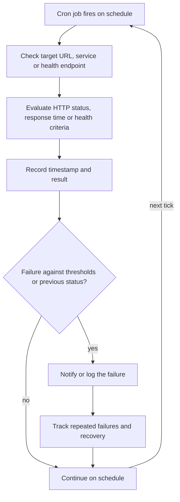
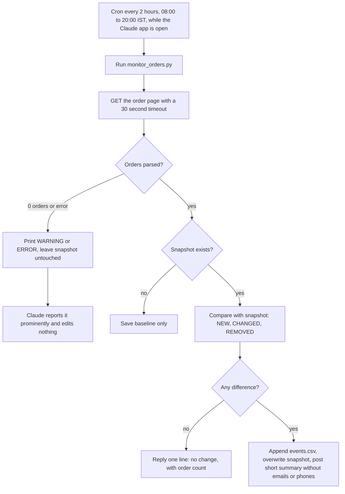

# Cron-based website and application monitoring

> Scheduled checks that detect website and application issues; the Café Grato order monitor is the one concrete, documented instance.

| | |
|---|---|
| **Category** | Integrations and operations |
| **Status** | Reference, as of 9 Oct 2026. Portfolio KB label: User-confirmed completed. The documented instance, the Café Grato order monitor, is Live (enabled since 9 Oct 2026) |
| **Type** | Cron-scheduled health check pattern; instance is a local Claude scheduled task running a Python script |
| **Runner and schedule** | Pattern: a cron job (targets and intervals not recorded). Instance: local task, cron `0 8-20/2 * * *`, runs only while the Claude desktop app is open |
| **Client / owner** | Owner: Hari. Instance is for the Café Grato client |
| **Stack** | cron, HTTP checks; instance: Python standard library only, no environment variables |
| **Source** | Portfolio KB section 15 (lines 503-535). Main KB Part 1, "Café Grato live order monitor" (lines 556-596) and Part 6A (Café Grato app) |

## 1. Description

### What it does
Portfolio KB: a cron job checks a target URL, service or application health endpoint, evaluates status, response time or other criteria, records a timestamp and result, compares with thresholds or the previous status, notifies or logs on failure, keeps checking, and tracks repeated failures and recovery. The precise targets, intervals, thresholds and notification destinations were not recorded.

### Inputs and outputs
- **Inputs:** Target URL or health endpoint; thresholds. Instance: `GET` of the client's order page and the previous `snapshot.json`.
- **Outputs:** A recorded result and, on failure, a notification or log entry. Instance: a one-line "no change" or a short event summary in the scheduled session, an `events.csv` history and an overwritten snapshot.

### Key components
| Component | Role |
|---|---|
| Cron schedule | Starts each check |
| Check script | Fetches the target and evaluates it |
| State | Previous status or snapshot used for comparison |
| Notifier or log | Reports failures and, ideally, recovery |

### Where it lives
Portfolio KB: monitored targets and cron configuration "need to be copied from the actual cron configuration". Instance (Part 1): script and data in `D:\Project\Client & Agency (Pivot)\cafe_grato\` (`monitor_orders.py`, `monitor_data\`), task prompt in `C:\Users\<user>\.claude\scheduled-tasks\cafe-grato-order-monitor\SKILL.md`, cron set in the Claude desktop Scheduled sidebar. The portfolio KB does not name Café Grato, so the link between the two is the main KB's evidence of the pattern, not a confirmed identity. See [cafe-grato-order-monitor.md](../01-scheduled-tasks-reporting/cafe-grato-order-monitor.md).

## 2. Flow chart

Primary chart: the general process from the portfolio KB, not a recorded configuration.

**Reading the chart**
1. Cron starts the check on schedule.
2. The target is checked and its status, speed or health criteria evaluated.
3. The result is recorded with a timestamp.
4. It is compared with thresholds or the previous status.
5. A failure is notified or logged and repeated failures and recovery are tracked.
6. Checking continues on the next tick.

Second chart: the documented instance, the Café Grato order monitor (Part 1). Reporting only; it never edits the page or contacts customers.

**Reading the second chart**
1. Cron `0 8-20/2 * * *` runs the script every 2 hours; missed runs fire on the next app launch.
2. The script fetches the order page and splits it into orders; an order that vanished is REMOVED, an unseen id is NEW, and a different total, items, name or contact is CHANGED.
3. Zero orders parsed or an error is surfaced prominently and the snapshot is left alone (page locked, down or layout changed).
4. No change gives a single line; any event is summarised without customer emails or phones.

## 3. Case study

### The challenge
Portfolio KB: detect website and application issues without watching them manually. Instance: the Café Grato ordering app (PHP, migrated from a previous system) needed a watcher so migrated orders were seen to appear and deletions were noticed (Part 1).

### The solution
A cron-driven check with state and a tolerance for the unknown. The instance is read-only (`GET` only) with a first-run baseline, three event types, a CSV history and a defensive "parsed 0 orders" warning. A faked new, changed and removed order were all detected in the build test, then reset to a clean baseline.

### Design decisions and rules learned
Portfolio KB reliability suggestions: set timeouts; separate a transient failure from sustained downtime; prevent alert storms with deduplication and cooldowns; monitor the monitor; keep secrets out of scripts; document timezone and schedule; send recovery notices. How the instance compares (Part 1):
- Timeout: 30 seconds, documented. Secrets: standard library only, no environment variables; the snapshot holds customer details, so the data folder is git-ignored.
- Timezone: cron is in the machine's IST, which makes the window 12:30 to 00:30 AEST for an Australian site; the KB marks this as possibly unintended (inferred).
- Not documented: transient versus sustained handling, cooldowns, monitoring the monitor, recovery notices. No Slack or email alerts exist yet; a Slack channel for it does not exist.
- Read-only monitors stay read-only (main KB golden rule 18).

### Outcome
Instance (Part 1, as of 9 Oct 2026): task created and enabled on 9 Oct; baseline built on 8 Oct; one recorded run (9 Oct 12:39 IST, manual "Run now") reporting no change in 35 orders (24 retail, 8 subscription, 3 wholesale sample); `events.csv` does not exist yet because no event has been detected. The general pattern has no measured outcome recorded.

### Lessons learned
- The monitor depends on the order page keeping its layout, so a layout change silently breaks parsing; the zero-orders warning exists for exactly that case.
- "Succeeded" for a scheduled run only means the session ended; read the output.
- Security and credential-hygiene findings for the monitored application are tracked privately and are not published here.

## 4. Operating notes
- **Run / pause / debug:** Instance: Scheduled sidebar, Run now, or the PowerShell command in the task; pause with the toggle; change speed by editing the cron; `python monitor_orders.py --reset` re-baselines after a legitimate bulk change. If it prints WARNING or ERROR, open the page in a browser before touching any parsing rules.
- **Known issues and open items:** No alerting channel exists yet.
- **Risks:** Runs only while the Claude desktop app is open; a layout change breaks parsing.
- **Documentation still needed (pattern):**
  - [ ] Actual monitored targets and health endpoints
  - [ ] Check intervals, timezone and thresholds
  - [ ] Notification destinations and recovery rules
  - [ ] Whether any other cron monitors exist beyond Café Grato

## 5. Related
- [cafe-grato-order-monitor.md](../01-scheduled-tasks-reporting/cafe-grato-order-monitor.md)
- [blog-engine-watchdog.md](../02-content-seo-newsletters/blog-engine-watchdog.md) (a legacy daily check that the blog engines fired, alerts on failure only)
- [slack-team-notifications.md](slack-team-notifications.md)
- **Sources:** Portfolio KB sections 15 and 29-34. Main KB Part 1 (overview table, Café Grato section), Part 6A (Café Grato app), golden rule 18.
