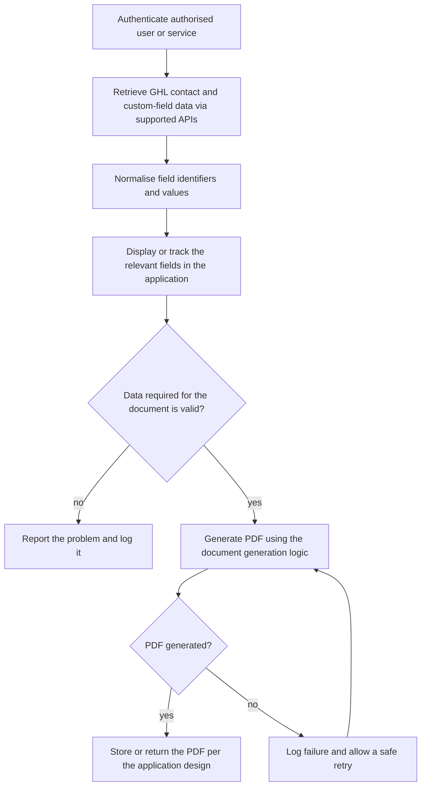

# GHL custom-field tracking application

> A custom application that tracks GoHighLevel custom-field data and supports PDF-generation workflows, as described in the portfolio knowledge base.

| | |
|---|---|
| **Category** | Integrations and operations |
| **Status** | Reference, as of 9 Oct 2026. Portfolio KB label: User-confirmed completed (live state and architecture not verified in any source) |
| **Type** | Custom web application (exact form not documented) |
| **Runner and schedule** | Not documented in the source |
| **Client / owner** | Owner: Hari. Client or sub-account: not documented in the source |
| **Stack** | GoHighLevel APIs for contact and custom-field data; a PDF library (unknown) |
| **Source** | Portfolio KB section 8 (lines 260-286). Related main KB evidence is listed under "Where it lives" and is NOT confirmed as this application |

## 1. Description

### What it does
Retrieves GHL contact and custom-field data through supported APIs, normalises field identifiers and values, displays or tracks the relevant fields, validates the data needed for a document, and generates a PDF. The PDF is stored or returned according to the application's design, and failures are logged so retries are safe (portfolio KB).

### Inputs and outputs
- **Inputs:** GHL contact and custom-field data; an authorised user or service identity.
- **Outputs:** A view or tracking record of custom fields, and a generated PDF.

### Key components
| Component | Role |
|---|---|
| Authentication | Identifies the authorised user or service (model not documented) |
| GHL API client | Reads contact and custom-field data |
| Field normaliser | Standardises field identifiers and values |
| Tracking view | Shows or tracks the relevant fields |
| Validation and PDF generator | Checks required data, then renders the document |
| Storage and logging | Stores or returns the PDF, records failures |

### Where it lives
Not documented in the source. The portfolio KB says the authentication model, storage design, PDF library and deployment architecture are not available and "must be filled in from the actual application source". No repository, folder or environment variables are named.

The main KB does not describe an application called a custom-field tracker. It does hold real code with the same ingredients, which may or may not be related; the main KB does not link them to this item:
- BNI Network Value Calculator and PDF factory: resolves custom-field IDs from keys, then writes a PDF link, score and result URL to the contact (Part 5 s10; Part 6, BNI / Franchise PDF factory). See [bni-network-value-calculator-and-pdf-factory.md](../05-excel-workflow-tools/bni-network-value-calculator-and-pdf-factory.md).
- Clixpert job orders: builds a PDF per job order and writes its link into a GHL custom field (Part 6A).
- Authority Inner Circle: syncs 16 contact custom fields prefixed `AIC` from its own database (Part 6A).

## 2. Flow chart

Documented general process from the portfolio KB, not a recorded design.

**Reading the chart**
1. The user or service is authenticated (model unknown).
2. Contact and custom-field data is retrieved through supported GHL APIs.
3. Field identifiers and values are normalised.
4. The relevant fields are displayed or tracked in the application.
5. The data needed for the document is validated; invalid data is reported and logged.
6. The PDF is generated by the application's document logic.
7. Success stores or returns the PDF; failure is logged and can be retried safely.

## 3. Case study

### The challenge
GHL custom fields hold the data that drives documents, and the team needed a place to see and track them and to produce PDFs from them. The portfolio KB gives no further business context.

### The solution
A custom application on top of the GHL APIs, confirmed as completed by the owner. Apart from the general process above, its design was not captured.

### Design decisions and rules learned
Only the general rule set below is documented. The first two points come from the main KB's consolidated GHL API notes (Part 3 s16) and apply to any app that reads custom fields; they are not statements about this application.
- Custom fields exist only for contacts and opportunities, not appointments. A call without `model=opportunity` returns contact fields only, so a field check can wrongly report opportunity fields as missing.
- Cloudflare "Error 1010" (a blocked default Python User-Agent) can look like a revoked token and make a field check report everything as missing. Use a browser-like User-Agent.
- Log failures and make retries safe (portfolio KB section 8, step 8).

### Outcome
No measured outcome recorded.

### Lessons learned
- Resolve custom-field IDs from field keys through the API rather than hard-coding them (the pattern the BNI PDF factory uses in the main KB, Part 5 s10).
- Document the architecture from source, because the history behind the portfolio KB did not contain it.

## 4. Operating notes
- **Run / pause / debug:** Not documented in the source.
- **Known issues and open items:** All architecture detail is missing.
- **Risks:** Custom-field data can include personal contact information, so storage and access rules matter. The source does not say how that is handled.
- **Documentation still needed:**
  - [ ] Repository or folder, entry point and hosting
  - [ ] Authentication model and token owner
  - [ ] Which fields are tracked and how they are shown
  - [ ] PDF library, template and where PDFs are stored
  - [ ] Environment variable names and GHL scopes
  - [ ] Whether it is the same code as any of the main KB items listed above

## 5. Related
- [bni-network-value-calculator-and-pdf-factory.md](../05-excel-workflow-tools/bni-network-value-calculator-and-pdf-factory.md) (comparable custom-field plus PDF code, not confirmed as the same app)
- [ghl-api-contracts-and-quirks.md](../03-ghl-crm-migrations/ghl-api-contracts-and-quirks.md)
- [ghl-webhook-automation.md](ghl-webhook-automation.md)
- **Sources:** Portfolio KB section 8. Main KB Part 3 s16, Part 5 s10, Part 6A (Clixpert job orders, Authority Inner Circle, BNI / Franchise PDF factory).
