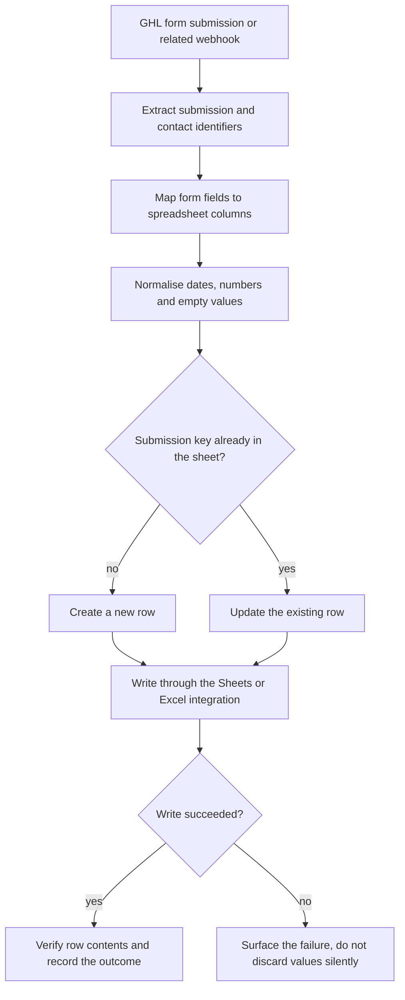
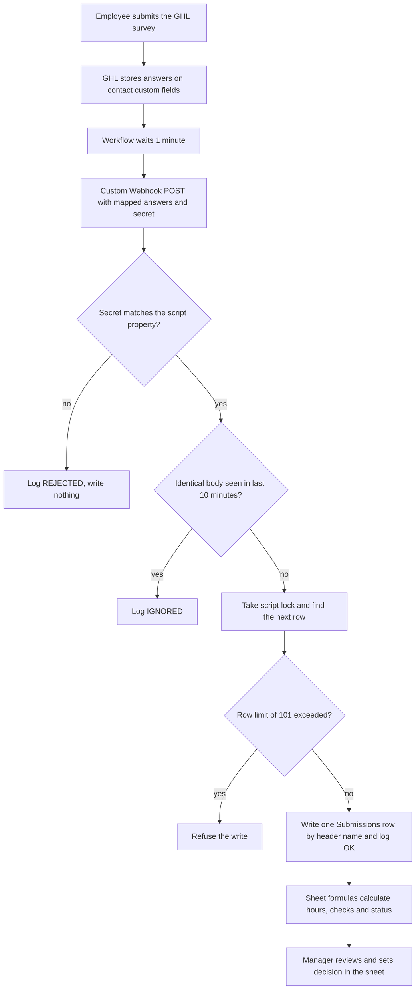

# GHL forms to Excel and Google Sheets sync

> Transfers GoHighLevel form and survey submissions into spreadsheet rows; the main KB documents one concrete design of this pattern in the Scope Stainless timesheet.

| | |
|---|---|
| **Category** | Integrations and operations |
| **Status** | Reference, as of 9 Oct 2026. Portfolio KB label: User-confirmed completed. The main KB's concrete design (timesheet variant B) is tested in parts but its GHL side is not built |
| **Type** | Webhook or workflow to spreadsheet writer |
| **Runner and schedule** | Event-driven on each submission. Provider and topology to be confirmed from the workflow configuration (portfolio KB) |
| **Client / owner** | Owner: Hari. Concrete design is for the client Scope Stainless Works |
| **Stack** | GHL forms and surveys, GHL workflow Custom Webhook, Google Sheets or Excel, Google Apps Script (in the documented design) |
| **Source** | Portfolio KB section 12 (lines 399-429). Main KB Part 5 s1-2 (Scope Stainless timesheet), s13 (gotchas) and s14 (gaps) |

## 1. Description

### What it does
Triggers on a GHL form submission or a related webhook, extracts the submission and contact identifiers, maps form fields to spreadsheet columns, normalises dates, numbers and empty values, then creates or updates a row through a Sheets or Excel integration. It records the outcome, surfaces failures and verifies the row (portfolio KB).

### Inputs and outputs
- **Inputs:** A GHL form or survey submission (or webhook payload) with submission and contact identifiers.
- **Outputs:** A new or updated spreadsheet row and a recorded outcome. In the main KB design, also a `Log` tab entry per delivery.

### Key components
| Component | Role |
|---|---|
| GHL form, survey and workflow | Collects answers and sends them on |
| Column mapping (documented configuration) | Maps fields to columns |
| Sheets or Excel writer | Native GHL action, or in the main KB design an Apps Script web app |
| Stable submission or contact key | Prevents duplicate rows |
| Review layer | In the main KB design, Sheet formulas plus a manager decision column |

### Where it lives
Portfolio KB: not recorded; "the specific spreadsheet provider and final production topology should be confirmed from the workflow configuration".

Main KB concrete design (Part 5 s2): `D:\Project\Client & Agency (Pivot)\excel operation\ghl-sheet-demo\`, with `apps-script\Code.gs`, workbook `Scope_Stainless_Timesheet_GHL_Sheet.xlsx` and `GHL-BUILD-GUIDE.md`. A shared secret held as a script property guards the web app. See [scope-stainless-works-digital-timesheet.md](../05-excel-workflow-tools/scope-stainless-works-digital-timesheet.md).

## 2. Flow chart

Primary chart: the general process from the portfolio KB, not a recorded run.

**Reading the chart**
1. A form submission or webhook starts the run; submission and contact identifiers are extracted.
2. Fields are mapped to columns from a documented configuration, and values are normalised.
3. A stable key decides between creating a row and updating one.
4. The row is written through the Sheets or Excel integration.
5. Success is verified and recorded; failure is surfaced rather than lost.

Second chart: the concrete design in the main KB (Part 5 s2, Scope Stainless timesheet variant B). It is a build design with partial tests, not a confirmed live run.

**Reading the second chart**
1. The survey answers sit on contact custom fields; the workflow waits 1 minute so the fields finish saving, then posts them with a shared secret.
2. The Apps Script web app rejects a wrong secret and ignores an identical delivery inside 10 minutes.
3. A script lock stops simultaneous submissions sharing a row; the write is refused past row 101.
4. One raw row is written, header names decide the column, and Sheet formulas do all calculation.
5. A person approves in the sheet; a resubmission becomes a new row and the older one shows as Superseded.

## 3. Case study

### The challenge
Form data captured in GHL had to land in spreadsheets without manual copying, without duplicate rows, and without silently dropping invalid values. For Scope Stainless Works the aim was to replace a handwritten weekly timesheet with a GHL survey plus a Google Sheet and no servers of the owner's own.

### The solution
Portfolio KB: a trigger, mapping, normalisation, create-or-update and verification process using a Sheets or Excel integration. Main KB: after rejecting an HTML plus n8n variant, the team chose GHL survey, workflow Custom Webhook, Apps Script intake and Sheet formulas. Options weighed and set aside included a native GHL Google Sheets action (kept as Option 2), manual CSV export, Excel Power Query, a marketplace sheet-sync app, GHL's Google Sheets AI connector (poor fit for a 65-column deterministic write) and a daily API pull of survey submissions.

### Design decisions and rules learned
- Use a stable key to avoid duplicates; keep column mappings in documented configuration; handle concurrent submissions; restrict sheet access; never discard invalid values silently (portfolio KB).
- GHL contact custom fields are overwritten on each submission, so the Sheet is the record (Part 5 s1).
- An Apps Script "on form submit" trigger fires only for Google Forms; for a GHL survey the web-app deployment is the trigger (Part 5 s2).
- Times are kept as text because GHL has no time-of-day field; mistakes are caught in the Sheet, not blocked on the phone.
- Never type in, sort, filter, insert or delete on the `Submissions` or `Calc` tabs.
- Set the Sheet locale to Australia so dd/mm/yyyy dates parse; n8n Append-or-Update never deletes rows (Part 5 s13).

### Outcome
Portfolio KB: user-confirmed completed. Main KB facts: workbook formulas tested in real Excel through 11 scenarios with zero error cells; Apps Script logic tested with 6 mocked tests; a real run of `doPost` from the editor correctly logged a rejection for a missing secret. Not tested in Google Sheets. The GHL custom fields, survey and workflow were specs only, and the transcript ends on 7 Oct 2026 before the web-app deploy was confirmed (Part 5 s2, s14).

### Lessons learned
- Discrepancy between the KBs: the portfolio calls this workstream completed, while the main KB shows the Scope Stainless build stopping before the GHL side existed. Another completed form-to-sheet workflow may exist outside the main KB; none was found.
- Say plainly which behaviour of GHL and Apps Script is unverified until it is seen working.

## 4. Operating notes
- **Run / pause / debug:** Main KB design only: check the web app responds (`doGet` returns an ok message) and read the `Log` tab. GHL may show a 302 as failed; judge by whether the row appears (Part 5 s2).
- **Known issues and open items:** The `Submissions` capacity is 100 rows; numbers that arrive left-aligned arrived as text and are flagged; the 38-hour overtime figure is a placeholder.
- **Risks:** Sheet access must be restricted. Security and credential-hygiene findings for this project are tracked privately and are not published here.
- **Documentation still needed:**
  - [ ] Spreadsheet provider and the production workflow configuration
  - [ ] Column mapping for each form
  - [ ] Whether any form-to-sheet flow is live today

## 5. Related
- [scope-stainless-works-digital-timesheet.md](../05-excel-workflow-tools/scope-stainless-works-digital-timesheet.md)
- [ghl-webhook-automation.md](ghl-webhook-automation.md)
- **Sources:** Portfolio KB section 12. Main KB searched for "survey", "Apps Script" and "Sheet": Part 5 s1, s2, s13, s14. Other Apps Script and Sheet uses (BNI Oasis Connect, Part 6A; `project-scope-tracker`, Part 8) are not GHL form syncs.
