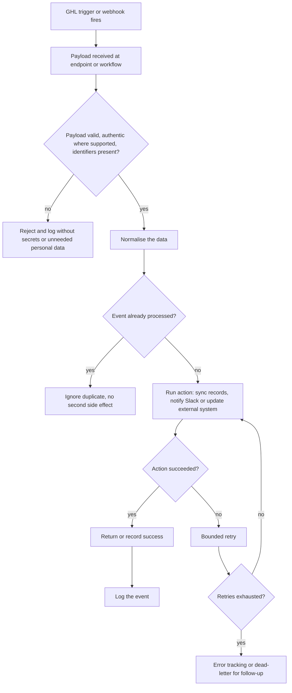

# GHL webhook automation

> A reusable pattern for using GoHighLevel events and webhooks to trigger external workflow logic such as record syncs, Slack alerts and PDF builds.

| | |
|---|---|
| **Category** | Integrations and operations |
| **Status** | Reference, as of 9 Oct 2026. Portfolio KB label: User-confirmed completed (a reusable pattern, not a single recorded build) |
| **Type** | Webhook-triggered pattern with several documented instances |
| **Runner and schedule** | Event-driven, no schedule. Receivers differ by instance (see Description) |
| **Client / owner** | Owner: Hari. Instances sit in client and P2T sub-accounts, see the table below |
| **Stack** | GHL workflows (Custom Webhook, Inbound Webhook), HTTP endpoints, plus whatever receiver the instance uses |
| **Source** | Portfolio KB section 10 (lines 332-363). Main KB Parts 3, 5 and 6 supply the concrete instances cited below |

## 1. Description

### What it does
Configures a GHL trigger or webhook, receives the payload at an endpoint or workflow, validates it, normalises the data, then runs the required action (sync records, notify Slack, update an external system), records the result and supports retries. The portfolio KB states that the precise list of events and destinations was not available, so it describes the reusable pattern and does not assert unrecorded actions.

### Inputs and outputs
- **Inputs:** A GHL event payload with contact and event identifiers (payload shape varies per instance).
- **Outputs:** A success or error response, the downstream action, and a log entry.

### Key components
| Component | Role |
|---|---|
| GHL workflow trigger or webhook | Sends the event |
| Receiver endpoint or workflow | Accepts and validates the payload |
| Normaliser and action step | Cleans data, then syncs, notifies or updates |
| Idempotency, retry and error tracking | Prevent duplicates and keep persistent failures visible |

### Where it lives
Pattern: not documented in the source. Concrete instances found in the main KB (each is a separate project, none confirmed to be "the" webhook automation of the portfolio KB):
| Instance | What the main KB records | Reference |
|---|---|---|
| BNI and Franchise PDF factory | GHL survey, then workflow Custom Webhook to the service's webhook endpoint with `contact_id` and answers; replies 200 at once and builds the PDF in the background | Part 5 s10, Part 6A. See [bni-network-value-calculator-and-pdf-factory.md](../05-excel-workflow-tools/bni-network-value-calculator-and-pdf-factory.md) |
| Clixpert job orders | A PHP webhook script stores every field in a `job_orders` table and returns a status JSON | Part 6A |
| Scope Stainless timesheet | Variant A (superseded, never connected to real GHL): Custom Webhook to n8n. Variant B: Custom Webhook to an Apps Script web app guarded by a shared secret | Part 5 s1-2. See [scope-stainless-works-digital-timesheet.md](../05-excel-workflow-tools/scope-stainless-works-digital-timesheet.md) |
| ServiceM8 two-way sync | Design only: Inbound Webhook, a robot contact, a small Cloudflare Worker, loop-guard tag | Part 3 s3 and Part 5 s3. See [servicem8-ghl-two-way-sync-blueprint.md](../03-ghl-crm-migrations/servicem8-ghl-two-way-sync-blueprint.md) |
| Pivot GHL Hub | A webhook endpoint stub, not yet implemented | Part 5 s8 |

## 2. Flow chart

Documented general process and safeguards from the portfolio KB; instance details differ.

**Reading the chart**
1. A GHL trigger or webhook sends the event.
2. The endpoint or workflow receives the payload and checks it: required identifiers, and authenticity where the platform supports it.
3. Invalid payloads are rejected and logged without secrets or unnecessary personal data.
4. Valid data is normalised.
5. Duplicate events are ignored so actions stay idempotent.
6. The action runs: sync records, notify Slack, or update an external system.
7. Failures are retried a bounded number of times, then moved to error tracking.
8. Successes are returned or recorded, and the event is logged.

## 3. Case study

### The challenge
GHL workflows can start events but cannot do heavy logic themselves (PDFs, scoring, record syncs, sheet writes). External systems needed to react to GHL events reliably without duplicating work.

### The solution
A webhook pattern: GHL sends a payload, an external receiver validates and acts, and the result is logged. The owner confirmed the work as completed; the portfolio KB records the pattern only, not a full event list.

### Design decisions and rules learned
Portfolio KB safeguards: validate webhook authenticity where supported, avoid logging secrets or unnecessary personal information, make actions idempotent, use bounded retries and dead-letter tracking, and document event names, payload examples and API scopes.

From the main KB instances (real files and transcripts):
- Reply 200 immediately and do heavy work in the background (BNI PDF factory).
- GHL custom data cannot nest, so payloads are flat key/value (Scope timesheet, Part 5 s1).
- Derive a hash-based submission ID so an identical retry is ignored but a real resubmission is not (Part 5 s1); Apps Script instead ignores an identical body within 10 minutes (Part 5 s2).
- Google answers an Apps Script web app with a 302, so GHL may show the call as failed; judge by the row and the Log tab (Part 5 s2).
- Only the Inbound Webhook trigger is premium; Custom Webhook may be a paid action; workflows enrol a contact, so an event with no email or phone needs a robot-contact workaround; GHL's Workflow AI Builder cannot test or finish webhook mapping or authentication (Part 3 s3 and s16; Part 5 s3).
- GHL has no native action to create a blog post and an inbound webhook cannot create one either (Part 2 s13).

### Outcome
No measured outcome recorded.

### Lessons learned
- Webhook receivers need authentication; the Apps Script variant B uses a shared secret, and every receiver should verify the sender in some way.
- A tag or stage change can act as the event bus when a premium trigger is to be avoided (ServiceM8 sync design, not built).

## 4. Operating notes
- **Run / pause / debug:** Not documented for the pattern. Per instance, see the linked files.
- **Known issues and open items:** The full list of events and destinations is not recorded.
- **Risks:** Duplicate side effects if the same event is retried. Security and credential-hygiene findings for the individual receivers are tracked privately and are not published here.
- **Documentation still needed:**
  - [ ] Event names, each destination and payload examples
  - [ ] API scopes and credential owners (names only)
  - [ ] How authenticity is checked for each receiver
  - [ ] Retry limits and where failures are tracked

## 5. Related
- [ghl-forms-to-sheets-sync.md](ghl-forms-to-sheets-sync.md)
- [slack-team-notifications.md](slack-team-notifications.md)
- [ghl-api-contracts-and-quirks.md](../03-ghl-crm-migrations/ghl-api-contracts-and-quirks.md)
- **Sources:** Portfolio KB section 10 and section 29-31. Main KB Part 2 s13, Part 3 s3 and s16, Part 5 s1-3 and s8 and s10, Part 6A (Clixpert job orders, BNI / Franchise PDF factory).
