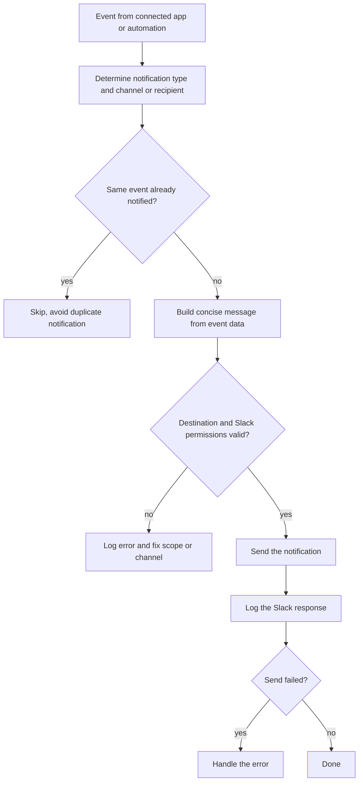
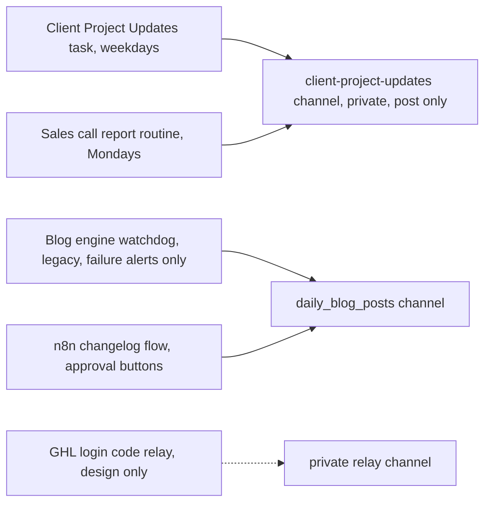

# Slack team notifications

> Automatically notifies the team in Slack when workflow events occur, such as task status updates, GHL webhook events and content approval requests.

| | |
|---|---|
| **Category** | Integrations and operations |
| **Status** | Reference, as of 9 Oct 2026. Portfolio KB label: User-confirmed completed (a shared pattern; the main KB shows several concrete Slack uses, some live, some legacy or design only) |
| **Type** | Notification pattern used by several automations |
| **Runner and schedule** | Event-driven in the portfolio KB. In the main KB, posts come from scheduled tasks and routines through the Slack connector |
| **Client / owner** | Owner: Hari. Channels are internal to P2T and HLGP (team only) |
| **Stack** | Slack (OAuth app in the portfolio KB; claude.ai Slack connector and n8n in the main KB) |
| **Source** | Portfolio KB section 13 (lines 432-458). Main KB Part 1, Part 2 s5 and s13, Part 3 s11, Part 7 (connectors table) |

## 1. Description

### What it does
Receives an event from a connected application, decides the notification type and channel or recipient, builds a concise message from the event data, checks the destination and Slack permissions, sends it, and logs the response and any error (portfolio KB).

### Inputs and outputs
- **Inputs:** Events from ClickUp status changes, GHL webhooks, content approval requests and other workflow status updates.
- **Outputs:** A Slack message, a logged response, and error handling when the send fails.

### Key components
| Component | Role |
|---|---|
| Event source | ClickUp, GHL, a content workflow, a scheduled task |
| Routing | Chooses channel or recipient by notification type |
| Message builder | Short message from event data |
| Destination and permission check | Valid channel, required scopes |
| Sender and logger | Posts, records the response, handles errors |

### Where it lives
Portfolio KB: not recorded. Main KB concrete uses (each its own project):
- The weekday client digest and the Monday sales report post to one private, team-only channel, `client-project-updates`, post only; nobody is invited and clients are never @-mentioned (Part 1). See [client-project-updates.md](../01-scheduled-tasks-reporting/client-project-updates.md) and [sales-call-report-dashboard.md](../01-scheduled-tasks-reporting/sales-call-report-dashboard.md).
- The legacy blog watchdog alerts only on failure, to the `daily_blog_posts` channel (Part 2 s5), and the older n8n changelog flow asks for approval there with buttons (Part 2 s13). See [blog-engine-watchdog.md](../02-content-seo-newsletters/blog-engine-watchdog.md) and [n8n-ghl-changelog-to-blog-and-newsletter.md](../02-content-seo-newsletters/n8n-ghl-changelog-to-blog-and-newsletter.md).
- A GHL login-code relay to a private Slack channel was designed, not built (Part 3 s11). See [ghl-login-otp-capture-design.md](../03-ghl-crm-migrations/ghl-login-otp-capture-design.md).
- The Café Grato monitor deliberately sends nothing to Slack; no channel exists for it (Part 1).

## 2. Flow chart

Primary chart: the general process from the portfolio KB. The duplicate check is the portfolio KB's caution about webhook retries.

**Reading the chart**
1. An event arrives from ClickUp, GHL, a content workflow or similar.
2. The type decides the channel or recipient.
3. Upstream retries must not produce a second message for the same event.
4. A short message is built, then the destination and permissions are checked.
5. The message is sent, the response logged, and failures handled.

Second chart: where the main KB shows Slack in use (producers to channels).

## 3. Case study

### The challenge
Many automations needed to tell the team something happened (a status change, a draft needing approval, a failed run) without people watching logs or transcripts. Retried webhooks risked repeat messages.

### The solution
A shared notification step: build a short message, check the destination and permissions, send, log. The main KB shows it in practice: a single digest post per run for client updates; a plain-language sales report; and an approval pattern in which nothing publishes until a human clicks Publish, with ignored drafts simply not published (Part 2 s13).

### Design decisions and rules learned
- Validate the destination and required Slack permissions before sending (portfolio KB).
- Avoid multiple notifications for one event when upstream systems retry (portfolio KB). In client updates, a keyed ledger prevents duplicates (Part 1).
- Post to a private, team-only channel; never invite or @-mention clients (Part 1, golden rule 10).
- Alert on failure only for the watchdog; never post success messages (Part 2 s5).
- Keep one-time login codes out of files and repositories, and keep the relay channel private (Part 3 s11).
- Corrections go as a thread reply, as done once on 24 Sep when a post said 10 queued items instead of 7 (Part 1).
- Keep the digest under 3,000 characters and use a short "nothing new" line when empty (Part 8, `client-project-updates`).

### Outcome
Portfolio KB: user-confirmed completed. Main KB: the Slack connector shows 41 calls across 3 projects, mostly `slack_send_message` (24), used for run summaries and notifications (Part 7). No notification counts per workflow are recorded.

### Lessons learned
- Slack errors seen in the ClickUp integration were a missing permission, a rejected credential and an invalid channel name (portfolio KB section 4).
- Failure alerting for the cloud blog routines does not exist yet; the watchdog was not ported (main KB, Part 2).

## 4. Operating notes
- **Run / pause / debug:** Per sender. For the daily digest, read the Slack post and the run transcript, because a "succeeded" scheduled run only means the session ended (main KB section 6).
- **Known issues and open items:** Café Grato Slack alerting is not implemented; the OTP relay was never built; the portfolio KB does not list its own Slack channels.
- **Risks:** A rejected credential or missing permission silently stops alerts. Wrong-channel posts could reach clients if a channel were shared.
- **Documentation still needed:**
  - [ ] Channel list and which event goes where for the portfolio KB workflows
  - [ ] Slack app permissions and credential owner (names only)
  - [ ] Whether the ClickUp and GHL notifications share a channel

## 5. Related
- [client-project-updates.md](../01-scheduled-tasks-reporting/client-project-updates.md)
- [clickup-slack-clockify-integration.md](clickup-slack-clockify-integration.md)
- [ghl-webhook-automation.md](ghl-webhook-automation.md)
- **Sources:** Portfolio KB sections 4, 10 and 13. Main KB Part 1 (overview and Client Project Updates), Part 2 s5 and s13, Part 3 s11, Part 7 connectors table, Part 8 `client-project-updates`, golden rules (section 3).
