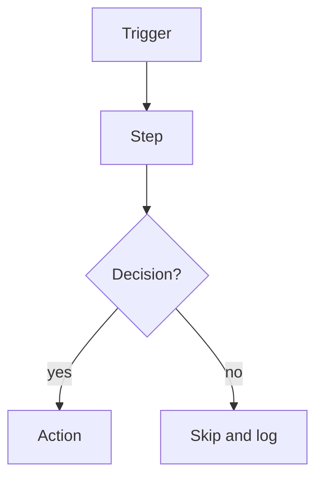

# {Project name}

> {One sentence: what it does and for whom.}

| | |
|---|---|
| **Category** | {e.g. Content, SEO and newsletters} |
| **Status** | {Live / On demand / Designed, not built / Legacy or retired / Personal tool}, as of 9 Oct 2026 |
| **Type** | {Scheduled task, n8n workflow, Python CLI, web app, skill, script ...} |
| **Runner and schedule** | {Where it runs and when. "Manual" if on demand.} |
| **Client / owner** | {P2T, HLGP, Stack&Code, or the client company} |
| **Stack** | {Tools, APIs, languages} |
| **Source** | {Main KB Part X section Y; Portfolio KB section Z} |

## 1. Description

### What it does
{2-4 sentences in plain language.}

### Inputs and outputs
- **Inputs:** {...}
- **Outputs:** {...}

### Key components
| Component | Role |
|---|---|
| {...} | {...} |

### Where it lives
{Folder paths, repo/branch names, config locations. Environment-variable NAMES only, never values.}

## 2. Flow chart

**Reading the chart**
1. {Step-by-step walkthrough, one line per main node.}

## 3. Case study

### The challenge
{The business problem or need, and the constraints.}

### The solution
{What was built and how it fits together.}

### Design decisions and rules learned
- {Decision or gotcha, and why.}

### Outcome
{Only what the sources document: counts, runs, dates, what is live. If nothing was measured, say "No measured outcome recorded."}

### Lessons learned
- {...}

## 4. Operating notes
- **Run / pause / debug:** {...}
- **Known issues and open items:** {...}
- **Risks:** {...}

## 5. Related
- {Links to related project files, with relative paths}
- **Sources:** {KB sections this file was written from}
